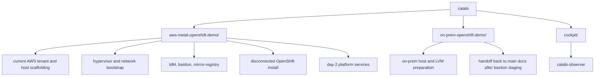

# Calabi

**A single-host, fully disconnected OpenShift 4 lab built on nested KVM --
Ansible-driven from bare metal to day-2 operators.**

Deploy a production-patterned OpenShift cluster (3 control-plane / 3 infra /
3 worker) on one AWS `m5.metal` instance with Open vSwitch VLAN segmentation,
agent-based installation, cgroup CPU performance domains, and disconnected
content mirroring.

<a href="./aws-metal-openshift-demo/README.md"><kbd>&nbsp;&nbsp;OPEN THE LAB&nbsp;&nbsp;</kbd></a>
<a href="./aws-metal-openshift-demo/docs/README.md"><kbd>&nbsp;&nbsp;DOCS MAP&nbsp;&nbsp;</kbd></a>

> [!WARNING]
> Experimental on-prem target: if you already have a prepared on-prem
> `virt-01`-like host and want the alternate LVM-backed path, start with
> <a href="./on-prem-openshift-demo/docs/README.md"><kbd>ON-PREM DOCS</kbd></a>.
> Those pages cover only the divergent early host and bastion-staging steps,
> then direct you back to the main docs once the normal Calabi flow resumes.

---

`Calabi` is shorthand for a `Calabi-Yau manifold` -- a play on folded
dimensions and the idea of folding a datacenter into one system.

The goal is not to make the environment as tiny as possible. It is to keep the
architecture close enough to reality that the lessons transfer -- something you
could explain to a real platform team without qualifiers.

Most of the implementation lives in
[aws-metal-openshift-demo](./aws-metal-openshift-demo/).

## Why This Approach Exists

Public cloud makes some installer paths harder to show cleanly than they should
be, especially when you want direct control over boot media and early host
behavior.

Agent-based and assisted installer patterns are much easier to reason about when
you can treat hosts like hosts:

- attach boot ISO media directly
- watch installer boot behavior closely
- keep support services nearby
- control the virtual switching and VLAN model
- rerun the install path without bending cloud primitives into unnatural shapes

Instead of piling on cloud-specific workarounds, this lab recreates the missing
substrate inside a controlled virtual environment so the same installer and
platform patterns can still be taught, demonstrated, and refined.

## What One Metal Host Is Standing In For

One host is obviously not the same thing as a real multi-instance public-cloud
deployment. The point here is to squeeze that shape down to something smaller
without losing the parts that matter. Right now the implementation uses AWS
`m5.metal`, but the approach is broader than AWS.

| Single-host lab on one metal instance | Representative public-cloud deployment |
| --- | --- |
| one RHEL hypervisor host with nested KVM guests | separate cloud instances or metal nodes for support services and OpenShift nodes |
| OVS plus VLAN-backed libvirt portgroups | VPC or VCN constructs, subnets, security policy, and instance NIC/network design |
| nested support guests: IdM, bastion, mirror-registry | dedicated external or shared-service instances |
| nested `3` control plane / `3` infra / `3` worker cluster | separate OpenShift instances or bare metal nodes |
| agent-based install media attached directly to VM shells | cloud-native install methods or more awkward boot-media workarounds |
| disconnected mirror workflow kept inside the lab | external mirror registry and egress-control design |
| Gold/Silver/Bronze VM performance domains on one host | priority and capacity choices spread across multiple hosts and node classes |
| one host used to model realistic service boundaries | many hosts used to implement those boundaries directly |

What carries over is not literal infrastructure scale. What carries over is the
pattern:

- support services are separated from cluster nodes
- networking is segmented intentionally
- installer behavior is observable
- disconnected content has a real workflow
- resource priority is explicit rather than accidental

## Current Project Layout

## Cockpit Plugins

The `cockpit/` directory contains Cockpit web console plugins that provide
operational visibility into the running lab. These are standalone packages
with their own RPM specs, deployed directly to `virt-01`.

| Plugin | Purpose |
| --- | --- |
| <a href="./cockpit/calabi-observer/"><kbd>calabi-observer</kbd></a> | Real-time observability for CPU performance domains and host memory oversubscription |

Each plugin has its own README and can be installed via RPM or rsync.

## Start Here

Use the buttons at the top of the page to drop into the lab itself or the docs
map.
