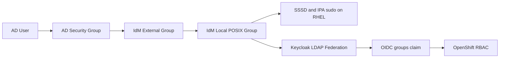

# AD Source-Of-Truth / IdM Policy Model

Nearby docs:

<a href="./automation-flow.md"><kbd>&nbsp;&nbsp;AUTOMATION FLOW&nbsp;&nbsp;</kbd></a>
<a href="./orchestration-plumbing.md"><kbd>&nbsp;&nbsp;ORCHESTRATION PLUMBING&nbsp;&nbsp;</kbd></a>
<a href="./orchestration-guide.md"><kbd>&nbsp;&nbsp;ORCHESTRATION GUIDE&nbsp;&nbsp;</kbd></a>
<a href="./manual-process.md"><kbd>&nbsp;&nbsp;MANUAL PROCESS&nbsp;&nbsp;</kbd></a>
<a href="./investigating.md"><kbd>&nbsp;&nbsp;INVESTIGATING&nbsp;&nbsp;</kbd></a>
<a href="./README.md"><kbd>&nbsp;&nbsp;DOCS MAP&nbsp;&nbsp;</kbd></a>

## Status

This document describes the target model and the implementation work now
underway.

The current orchestration already does:

- AD trust into IdM
- Keycloak OIDC for OpenShift
- IdM compat LDAP federation for Keycloak
- local IdM group `openshift-admin` bound to OpenShift `cluster-admin`
- local IdM group `admins` bound to the `admins-nopasswd-all` sudo rule

The current implementation now also includes the first policy-bridge slice:

- canonical mapping data in
  <a href="../vars/global/ad_group_policy.yml"><kbd>vars/global/ad_group_policy.yml</kbd></a>
- optional creation of one IdM external group per mapped AD group
- optional nesting of those external groups into the target local IdM groups
  during <a href="../playbooks/bootstrap/idm-ad-trust.yml"><kbd>playbooks/bootstrap/idm-ad-trust.yml</kbd></a>

What is still pending is consumer-side proof that those bridged local groups
drive the intended RHEL and OpenShift access end to end.

## Target Model

The target access path is:

The intent is:

- AD is the source of truth for users and source-side group membership
- IdM translates trusted AD groups into local policy groups
- RHEL and OpenShift consume only the IdM local groups
- OpenShift does not authorize against raw AD group names
- RHEL sudo and HBAC do not authorize against raw AD group names

## Planned Group Contract

The future-state mapping scaffold lives in
<a href="../vars/global/ad_group_policy.yml"><kbd>vars/global/ad_group_policy.yml</kbd></a>.

The current planned mappings are:

| AD group | IdM external group | IdM local group | Intended access |
| --- | --- | --- | --- |
| `OpenShift-Admins` | `ad-openshift-admins` | `openshift-admin` | OpenShift `cluster-admin` |
| `Linux-Admins` | `ad-linux-admins` | `admins` | RHEL passwordless sudo via `admins-nopasswd-all` |
| `OpenShift-Virt-Admins` | `ad-openshift-virt-admins` | `virt-admin` | future virtualization-scoped policy |
| `Developers` | `ad-developers` | `developer` | future non-admin application access |
| `Ansible-Automation-Admins` | `ad-aap-admins` | `aap-admin` | future AAP authorization path |

## Deferred Hygiene: Naming And Descriptions

This is saved as follow-on housekeeping after the current rollout completes.

The current implementation now applies terse descriptions to both sides of the
bridge so the IdM web UI and `ipa group-show` output communicate the two roles
immediately:

- local IdM groups grant access
- external IdM groups are only upstream AD membership sources

Planned naming direction remains:

| Group type | Planned pattern | Example |
| --- | --- | --- |
| IdM local access group | `access-<scope>-<role>` | `access-openshift-admin` |
| IdM external AD source group | `ext-<domain>-<group>` | `ext-corp-lan-openshift-admins` |

Planned description pattern:

| Group type | Description template | Example |
| --- | --- | --- |
| IdM local access group | `Access group: <permission>` | `Access group: OpenShift cluster-admin` |
| IdM external AD source group | `AD source group: <domain>/<group>` | `AD source group: corp.lan/OpenShift-Admins` |

Why this is deferred:

- the current bridge is already wired and being exercised
- renaming the groups now would create extra churn while rollout validation is
  still in progress
- the current hygiene work is description-first so operators can see the role
  split without changing live names
- a later rename can still be done if we decide the `ad-*` bridge names are too
  noisy for long-term use

## Current Gap Versus Target

What exists now:

- AD demo groups are created on `ad-01`
- IdM local groups are created on `idm-01`
- IdM trust and compat are enabled
- Keycloak reads users and groups from the IdM compat tree
- the AD-to-IdM policy bridge data model is defined centrally
- IdM external groups and local-group nesting are now created from that mapping
  during the AD trust play

What does not exist yet:

- validation that an AD group change alone changes RHEL and OpenShift access
- proof that Keycloak emits the bridged local IdM groups for trusted AD users
- proof that RHEL sudo/HBAC are being granted through the bridged local groups
  rather than through broader trust behavior

## Implementation Plan

### Phase 1: Data Model

Add the future-state mapping data and keep it disabled by default.

Files:

- <a href="../vars/global/ad_group_policy.yml"><kbd>vars/global/ad_group_policy.yml</kbd></a>

Success criteria:

- one canonical mapping source exists in the repo
- the mapping covers OpenShift, RHEL, and AAP intent explicitly

Status:

- implemented

### Phase 2: IdM Trust Policy Objects

Create:

- one IdM external group per trusted AD group
- one nested membership from each external group into the target local IdM
  group

Likely ownership:

- <a href="../roles/idm_ad_trust/tasks/main.yml"><kbd>roles/idm_ad_trust/tasks/main.yml</kbd></a>
- possibly a new trust-policy subtask file if the role gets too large

Success criteria:

- `ipa group-show <local-group>` shows the external group as a member
- trusted AD users land in the correct local IdM policy group through nesting

Status:

- implementation landed in
  <a href="../roles/idm_ad_trust/tasks/main.yml"><kbd>roles/idm_ad_trust/tasks/main.yml</kbd></a>
- live validation still in progress

### Phase 3: RHEL Authorization Validation

Validate that:

- the AD-backed Linux admin user resolves through SSSD
- that user gains the local IdM `admins` policy
- `admins-nopasswd-all` applies without granting access via raw AD groups

Likely ownership:

- <a href="../roles/bastion_guest/tasks/main.yml"><kbd>roles/bastion_guest/tasks/main.yml</kbd></a>
- <a href="../roles/mirror_registry_guest/tasks/main.yml"><kbd>roles/mirror_registry_guest/tasks/main.yml</kbd></a>
- dedicated trust validation tasks or maintenance probes

### Phase 4: OpenShift Authorization Validation

Validate that:

- Keycloak emits the local IdM group names in the `groups` claim
- OpenShift continues to bind only the local group `openshift-admin`
- an AD user in `OpenShift-Admins` becomes cluster-admin only through the
  local IdM group bridge

Likely ownership:

- <a href="../roles/openshift_post_install_oidc_auth/tasks/main.yml"><kbd>roles/openshift_post_install_oidc_auth/tasks/main.yml</kbd></a>

### Phase 5: Optional AAP Alignment

If AAP remains in scope, give it the same policy model:

- trusted AD group
- IdM external group
- local IdM policy group
- AAP LDAP or SSO mapping against the local IdM group

## Guardrails

When this work is implemented, keep these constraints:

- do not use `Domain Admins` as the Linux admin policy group
- do not bind raw AD group names directly to OpenShift RBAC
- do not bind raw AD group names directly to IPA sudo rules
- keep `HTPasswd` breakglass unchanged
- keep the existing local IdM groups as the authorization boundary

## Validation Checklist

When implementation starts later, the minimum proof should be:

1. change AD group membership only
2. confirm IdM trust/compat reflects the change
3. confirm the corresponding local IdM group reflects the nested policy
4. confirm an AD-backed Linux admin user gains or loses sudo accordingly
5. confirm an AD-backed OpenShift admin user gains or loses `cluster-admin`
   accordingly
6. confirm native IdM users still work through the same local groups
