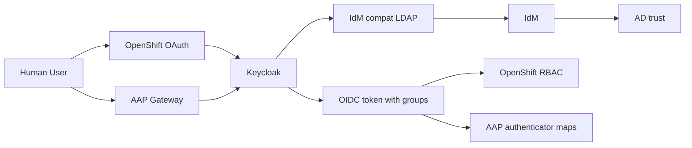
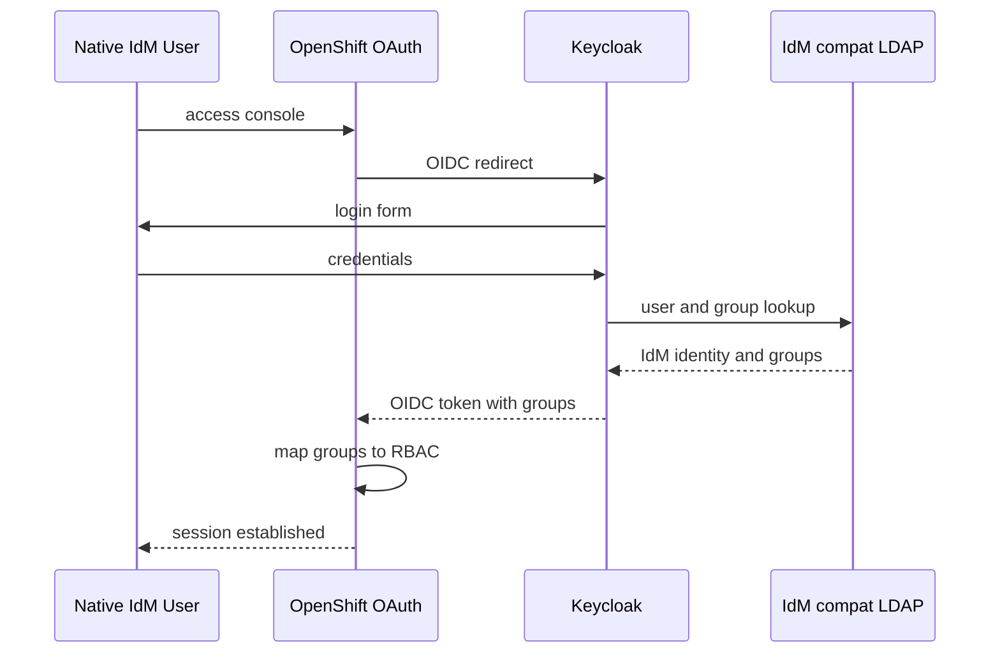
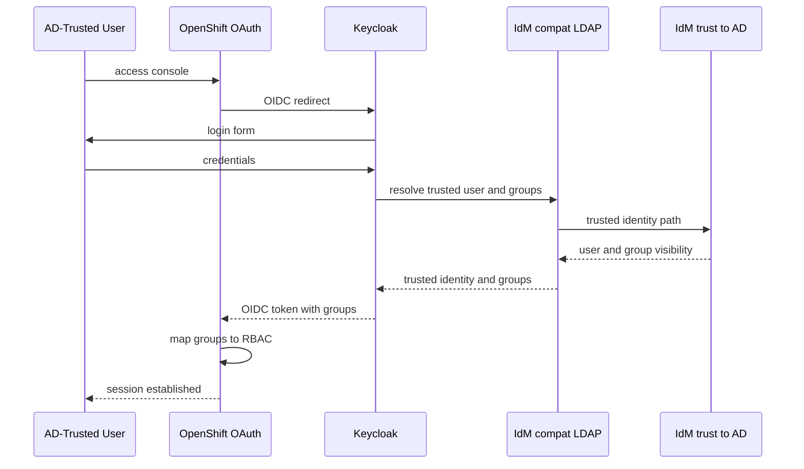

# Authentication Model

Nearby docs:

<a href="./automation-flow.md"><kbd>&nbsp;&nbsp;AUTOMATION FLOW&nbsp;&nbsp;</kbd></a>
<a href="./orchestration-plumbing.md"><kbd>&nbsp;&nbsp;ORCHESTRATION PLUMBING&nbsp;&nbsp;</kbd></a>
<a href="./manual-process.md"><kbd>&nbsp;&nbsp;MANUAL PROCESS&nbsp;&nbsp;</kbd></a>
<a href="./orchestration-guide.md"><kbd>&nbsp;&nbsp;ORCHESTRATION GUIDE&nbsp;&nbsp;</kbd></a>
<a href="./ad-idm-policy-model.md"><kbd>&nbsp;&nbsp;AD / IDM POLICY MODEL&nbsp;&nbsp;</kbd></a>
<a href="./README.md"><kbd>&nbsp;&nbsp;DOCS MAP&nbsp;&nbsp;</kbd></a>

## Purpose

This doc defines the supported authentication and authorization model.

It answers:

- what authenticates users
- what authorizes users
- what AD, IdM, Keycloak, OpenShift, and RHEL each own
- what the breakglass path is
- how the current model aligns with public zero-trust guidance

The planned future evolution where AD becomes the user and source-group system
of record while IdM local groups remain the authorization boundary is tracked
separately in <a href="./ad-idm-policy-model.md"><kbd>AD / IDM POLICY MODEL</kbd></a>.

## Current Supported Model

The supported default platform auth baseline is:

- `HTPasswd` breakglass for recovery
- Keycloak OIDC for human login
- IdM as the identity and policy hub
- OpenShift authorization through group claims
- AAP authorization through Keycloak groups plus gateway authenticator maps
- direct OpenShift LDAP auth disabled by default
- direct AAP LDAP retired from the preferred clean-build path

The current live IdM group descriptions are intentionally terse so operators
can distinguish access groups from AD source groups at a glance in the web UI
and `ipa` output.

At a high level:

The current repo proves two supported login cases:

- native IdM user -> Keycloak -> OpenShift
- AD-trusted user -> IdM trust/compat -> Keycloak -> OpenShift
- AD-trusted user -> Keycloak -> AAP

## Authorization Boundary

The most important rule in the current model is:

- authentication is brokered through Keycloak
- authorization is granted by group membership
- OpenShift and RHEL consume IdM-side policy groups

Today those IdM local groups are:

| IdM group | Current meaning | Current access |
| --- | --- | --- |
| `access-openshift-admin` | OpenShift platform admin | Bound to OpenShift `cluster-admin` |
| `access-linux-admin` | Linux/RHEL admin | Granted passwordless sudo by `admins-nopasswd-all` |
| `access-virt-admin` | reserved virtualization role | group exists; no broad privilege binding documented as default |
| `access-developer` | reserved non-admin role | group exists; no broad privilege binding documented as default |
| `access-aap-admin` | reserved AAP policy target | group exists in IdM and AD-trust mapping; current clean-build AAP superuser binding still uses `access-openshift-admin` |

That means:

- OpenShift cluster-admin is granted to the group `access-openshift-admin`
- RHEL sudo is granted to the group `access-linux-admin`
- privilege is not supposed to be inferred from broad ambient trust alone

## Component Responsibilities

### AD

AD currently provides:

- optional trusted external identities
- source-side AD users and AD groups for the trust path

AD does not directly grant OpenShift RBAC or IPA sudo in the current supported
model.

### IdM

IdM currently provides:

- identity hub for native lab users
- trust relationship to AD
- compat-tree visibility for trusted users and groups
- local policy groups such as `access-openshift-admin` and `access-linux-admin`
- RHEL-side policy such as the `admins-nopasswd-all` sudo rule

### Keycloak

Keycloak currently provides:

- web login broker for OpenShift
- LDAP federation to the IdM compat tree
- OIDC token issuance with `groups` claims

Keycloak is not the long-term source of authorization policy. It emits what the
IdM-side policy model gives it.

### OpenShift

OpenShift currently provides:

- OAuth/OIDC login integration
- claim-to-group mapping from the OIDC `groups` claim
- RBAC binding of `access-openshift-admin` to `cluster-admin`
- a separate `HTPasswd` breakglass path

### AAP

AAP currently provides:

- management-plane access through Keycloak OIDC
- gateway authenticator and authenticator-map enforcement
- superuser elevation from the emitted admin access group

In the validated clean-build path:

- AAP uses the Keycloak realm already deployed for cluster SSO
- the AAP client ID is `aap`
- the required admin group is `access-openshift-admin`
- direct AAP LDAP is not the supported default path

### RHEL Hosts

IdM-enrolled RHEL hosts currently provide:

- SSSD-backed user resolution
- IdM policy enforcement
- sudo authorization through IdM local groups

## Current Login Flows

### Native IdM User To OpenShift

### AD-Trusted User To OpenShift

## Breakglass

The breakglass path is intentionally separate from IdM, AD, and Keycloak.

It exists so cluster access remains available if:

- Keycloak is down
- IdM is down
- AD is down
- the trust path is degraded

That is why the repo keeps:

- a local `HTPasswd` identity provider
- a local breakglass admin binding

This is not a second preferred human-login path. It is a recovery control.

## Zero-Trust Alignment

This model is better described as zero-trust aligned than zero-trust complete.

Why it aligns:

- authentication and authorization are separated
- broad network location is not the trust boundary
- applications authenticate users directly rather than trusting network
  placement
- authorization is group-driven and explicit
- least privilege is expressible through narrowly scoped policy groups
- breakglass is isolated from the primary identity path

Why it is not sufficient on its own:

- zero trust also depends on session policy, logging, monitoring, MFA posture,
  device posture, and continuous validation
- those controls are larger than this repo’s auth topology alone

## Standards And Guidance Alignment

This architecture is not presented as formal certification or compliance by
itself. It is, however, directionally aligned with the following public
guidance:

- NIST SP 800-207 Zero Trust Architecture:
  - emphasizes that no implicit trust should be granted based on network
    location alone and that access decisions should be made per request and
    per resource
  - https://nvlpubs.nist.gov/nistpubs/SpecialPublications/NIST.SP.800-207.pdf
- OMB M-22-09, Federal Zero Trust Strategy:
  - pushes identity-centered access control, application-level access, and
    continual verification rather than perimeter trust
  - https://www.whitehouse.gov/wp-content/uploads/2022/01/M-22-09.pdf
- CISA Zero Trust Maturity Model 2.0:
  - frames zero trust around identity, device, network/environment,
    application/workload, and data pillars with cross-cutting governance and
    automation
  - https://www.cisa.gov/zero-trust-maturity-model
- FedRAMP Rev5 guidance:
  - emphasizes identity and access management, continuous monitoring, change
    management, secure configuration, and reusable authorization evidence
  - https://www.fedramp.gov/docs/rev5/
- PCI DSS access-control guidance:
  - aligns with business need-to-know, deny-by-default access control, unique
    identities, strong authentication, and MFA for administrative and remote
    access
  - https://www.pcisecuritystandards.org/standards/pci-dss/

The practical synergy is:

- least-privilege group-based authorization
- explicit application login rather than perimeter trust
- unique identities
- isolated emergency access
- cleaner separation between identity proof and authorization policy

## Planned Evolution

The future direction under consideration is:

- AD as the user and source-group system of record
- IdM external groups bridging trusted AD groups into local IdM policy groups
- local IdM groups remaining the authorization boundary for both RHEL and
  OpenShift

The first implementation slice for that bridge now exists in the orchestration:

- the mapping contract lives in
  <a href="../vars/global/ad_group_policy.yml"><kbd>vars/global/ad_group_policy.yml</kbd></a>
- the AD trust play can create the mapped IdM external groups and nest them
  into the target local groups

The remaining proof is now narrower and consumer-side:

- confirm AD-side membership changes alone drive the intended RHEL and OpenShift authorization end to end
- confirm RHEL sudo and related host policy follow the bridged local IdM groups on enrolled systems
- confirm revocation propagates cleanly across IdM compat, Keycloak, and downstream consumers

That future model is documented in
<a href="./ad-idm-policy-model.md"><kbd>AD / IDM POLICY MODEL</kbd></a>.

It should be treated as live bridge work with some remaining end-to-end proof, not as a fully closed authorization migration.
