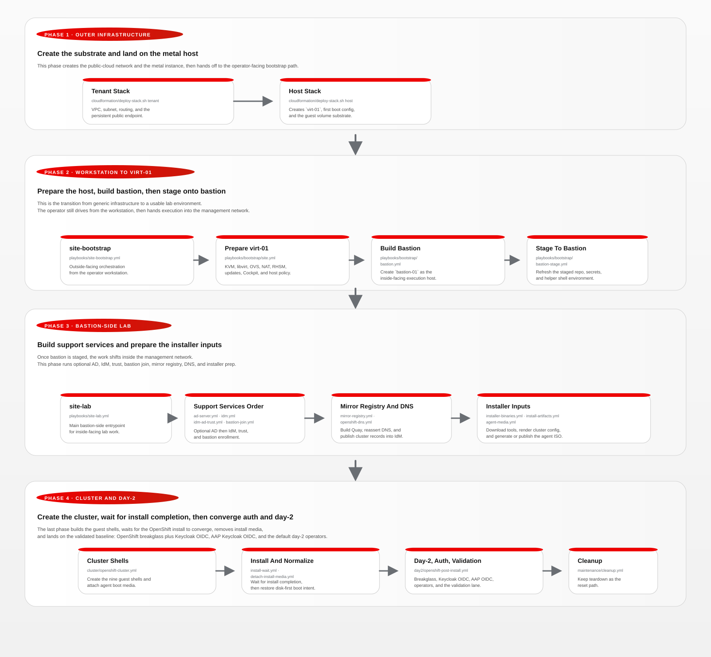

# Automation Flow

Nearby docs:

<a href="./prerequisites.md"><kbd>&nbsp;&nbsp;PREREQUISITES&nbsp;&nbsp;</kbd></a>
<a href="./iaas-resource-model.md"><kbd>&nbsp;&nbsp;IAAS MODEL&nbsp;&nbsp;</kbd></a>
<a href="./manual-process.md"><kbd>&nbsp;&nbsp;MANUAL PROCESS&nbsp;&nbsp;</kbd></a>
<a href="./orchestration-guide.md"><kbd>&nbsp;&nbsp;ORCHESTRATION GUIDE&nbsp;&nbsp;</kbd></a>
<a href="./README.md"><kbd>&nbsp;&nbsp;DOCS MAP&nbsp;&nbsp;</kbd></a>

## Operator Model

This page gives you the big-picture run order before you drop into playbooks
and roles.

If you are starting from zero, read
<a href="./prerequisites.md"><kbd>PREREQUISITES</kbd></a> first.

The lab moves through three execution contexts:

- AWS tenant and host provisioning for `virt-01`
- operator workstation/bootstrap to `virt-01`
- bastion-native execution from `bastion-01`

The host CPU-management design used by the bootstrap and guest-build phases is
documented separately in:

- <a href="./host-resource-management.md"><kbd>RESOURCE MANAGEMENT</kbd></a>

The two entrypoints are `playbooks/site-bootstrap.yml` and
`playbooks/site-lab.yml`.

## Flow Diagram

The SVG below is the easiest way to understand the happy path at a
glance. It groups the work into the same execution phases the operator
experiences in practice.



## Phase Summary

- Phase 1, outer infrastructure:
  - create the tenant and host stacks so `virt-01` exists with the expected
    network and guest-volume substrate
- Phase 2, workstation to `virt-01`:
  - bootstrap the hypervisor
  - build `idm-01` and `bastion-01`
  - stage the project onto bastion
- Phase 3, bastion-side lab:
  - build mirror-registry
  - publish OpenShift DNS
  - prepare installer binaries, artifacts, and agent media
- Phase 4, cluster and day-2:
  - create the nine nested OpenShift guests
  - wait for install completion
  - normalize the domain boot state and apply the baseline day-2 config

## Recommended Run Order

### Where each step runs

| Steps | Where | What happens |
| --- | --- | --- |
| 1-7 | Operator workstation | AWS stacks, hypervisor bootstrap, support VMs, bastion staging |
| 8-17 | `bastion-01` | Mirror registry, DNS, cluster build, day-2 configuration |

> [!IMPORTANT]
> **Pick a side and stay on it.** Steps 1-7 run from the operator workstation.
> Steps 8-17 run from the bastion. The project does not account for switching
> execution context mid-stream. If you start a bastion-side step from the
> workstation and then run the next step directly on bastion (or vice versa),
> generated state will diverge and later steps will fail in ways that are hard
> to diagnose.

### Command shorthand

- `RUN LOCALLY` — from the operator workstation at the project root
- `RUN ON BASTION` — from `bastion-01` at `/opt/openshift/aws-metal-openshift-demo`
- `./scripts/run_remote_bastion_playbook.sh` — runs a bastion play from the workstation (restages first)

1. `cloudformation/deploy-stack.sh tenant`
   - Renders and deploys the AWS tenant stack for the VPC, subnet, route table, and persistent Elastic IP reserved for `virt-01`.
   - Example:
     - `RUN LOCALLY`
       ```bash
       ./cloudformation/deploy-stack.sh tenant
       ```
1. `cloudformation/deploy-stack.sh host`
   - Renders and deploys the host-only CloudFormation stack for `virt-01`, its first-boot cloud-init configuration, security group, imported key pair, and the attached guest EBS volume set.
   - This remains the rebuild entrypoint when the AWS tenant already exists.
   - Example:
     - `RUN LOCALLY`
       ```bash
       ./cloudformation/deploy-stack.sh host
       ```
1. `playbooks/site-bootstrap.yml`
   - Runs the outside-facing bootstrap phase.
   - Example:
     - `RUN LOCALLY`
       ```bash
       ansible-playbook -i inventory/hosts.yml playbooks/site-bootstrap.yml
       ```
1. `playbooks/bootstrap/site.yml`
   - Waits for the full expected guest-disk inventory, derives the active AWS EBS mapping by `GuestDisk` tag, installs the inventory-driven `/dev/ebs/*` mapping, enforces `virt-01.workshop.lan`, configures RHSM/CDN access, registers the hypervisor with Red Hat Insights, ensures `ec2-user` is unlocked for Cockpit login, updates and reboots the hypervisor when required, installs the Cockpit and PCP host-management stack, configures manager-level host `CPUAffinity` plus the Gold/Silver/Bronze slice units, and configures `lab-switch`, libvirt networking, and host NAT.
   - Example:
     - `RUN LOCALLY`
       ```bash
       ansible-playbook -i inventory/hosts.yml playbooks/bootstrap/site.yml
       ```
1. `playbooks/bootstrap/idm.yml`
   - Builds `idm-01`, configures DNS/CA/KRA, Cockpit, session recording, RHSM/Insights, and IPA data.
   - The IdM install path now uses the FreeIPA server role for server/KRA and FreeIPA modules for users, groups, password policies, and sudo rules.
   - Example:
     - `RUN LOCALLY`
       ```bash
       ansible-playbook -i inventory/hosts.yml playbooks/bootstrap/idm.yml
       ```
1. `playbooks/bootstrap/bastion.yml`
   - Builds `bastion-01` on VLAN 100.
   - Joins it to IdM with the FreeIPA client role, enables RHSM/Insights, and turns on `with-mkhomedir` plus `with-sudo` so domain users get home directories and SSSD sudo rules on first login.
   - Example:
     - `RUN LOCALLY`
       ```bash
       ansible-playbook -i inventory/hosts.yml playbooks/bootstrap/bastion.yml
       ```
1. `playbooks/bootstrap/bastion-stage.yml`
   - Synchronizes the repo onto the bastion with `rsync`, preserving bastion-side `generated/` content and restaging the pull secret and SSH key.
   - Renders the bastion-local inventory.
   - Installs the bastion profile snippet and user helper links so `cloud-user` and IdM `admins` land with working `oc`, `kubectl`, `openshift-install`, helper scripts, and a conditional `KUBECONFIG`.
   - Example:
     - `RUN LOCALLY`
       ```bash
       ansible-playbook -i inventory/hosts.yml playbooks/bootstrap/bastion-stage.yml
       ```
---

### Bastion boundary — all remaining work runs from `bastion-01`

> [!WARNING]
> Everything below this line runs on the bastion. Do not switch back to the
> operator workstation for steps 8-17 unless you are deliberately debugging
> the automation itself. The golden path is bastion-native execution from this
> point forward. Once you cross this boundary, stay on bastion.

For resilient long-running execution, the bastion helper
`scripts/run_bastion_playbook.sh` writes PID, log, and exit-code state under
`/var/tmp/bastion-playbooks/`.

Bastion staging restores `cloud-user` ownership on the staged `generated/`
workspace so repeated cluster renders can recreate `generated/ocp` cleanly.

8. `playbooks/site-lab.yml`
   - Runs the full inside-facing lab phase from the bastion.
   - Support VMs (`idm-01`, `bastion-01`, and `mirror-registry`) now default
     to preserving their existing disks and libvirt domains on rerun instead of
     being rebuilt automatically.
   - After a successful mirror phase, the recommended resume point for a fresh
     cluster rebuild is:
     `./scripts/run_remote_bastion_playbook.sh playbooks/site-lab.yml --skip-tags mirror-registry`
   - On reruns, the day-2 portion now probes the major post-install phases and
     skips ones that are already configured and healthy.
   - Destructive ODF recovery is not part of a normal rerun. It must be
     explicitly forced with `-e openshift_post_install_force_odf_rebuild=true`
     (or the legacy `openshift_post_install_odf_force_osd_device_reset=true`).
   - Example:
     - `RUN ON BASTION`
       ```bash
       ansible-playbook -i inventory/hosts.yml playbooks/site-lab.yml
       ```
     - Alternatively, from the workstation:
       ```bash
       ./scripts/run_remote_bastion_playbook.sh playbooks/site-lab.yml
       ```
9. `playbooks/lab/mirror-registry.yml`
   - Builds `mirror-registry`, joins it to IdM, installs Quay, and prepares disconnected content tooling.
   - Default disconnected path is now `portable`, which runs both `m2d` and
     `d2m` in the same playbook invocation.
   - The import-only override remains available when an existing archive should
     be pushed without rerunning the pull phase:
     `-e mirror_registry_content_mode_override=import -e mirror_registry_content_workflow_override=d2m`.
   - The bastion installs:
     - `/usr/local/bin/track-mirror-progress`
     - `/usr/local/bin/track-mirror-progress-tmux`
   - Subsequent `m2d` and `d2m` runs also write guest-side logs such as:
     - `/var/log/oc-mirror-m2d.log`
     - `/var/log/oc-mirror-d2m.log`
   - Example:
     - `RUN ON BASTION`
       ```bash
       ansible-playbook -i inventory/hosts.yml playbooks/lab/mirror-registry.yml
       ```
     - Alternatively, from the workstation:
       ```bash
       ./scripts/run_remote_bastion_playbook.sh playbooks/lab/mirror-registry.yml
       ```
10. `playbooks/lab/openshift-dns.yml`
    - Creates the cluster DNS zones and records in IdM.
    - Example:
      - `RUN ON BASTION`
        ```bash
        ansible-playbook -i inventory/hosts.yml playbooks/lab/openshift-dns.yml
        ```
      - Alternatively, from the workstation:
        ```bash
        ./scripts/run_remote_bastion_playbook.sh playbooks/lab/openshift-dns.yml
        ```
11. `playbooks/cluster/openshift-installer-binaries.yml`
    - Downloads the exact OpenShift installer/client toolchain for the pinned mirrored release on the bastion.
    - Example:
      - `RUN ON BASTION`
        ```bash
        ansible-playbook -i inventory/hosts.yml playbooks/cluster/openshift-installer-binaries.yml
        ```
      - Alternatively, from the workstation:
        ```bash
        ./scripts/run_remote_bastion_playbook.sh playbooks/cluster/openshift-installer-binaries.yml
        ```
12. `playbooks/cluster/openshift-install-artifacts.yml`
    - Renders `install-config.yaml`, `agent-config.yaml`, and the IdM CA bundle on the bastion.
    - `agent-config.yaml` now renders per-node
      `rootDeviceHints.serialNumber` values from the libvirt root-disk serials
      instead of a hardcoded HCTL hint.
    - Example:
      - `RUN ON BASTION`
        ```bash
        ansible-playbook -i inventory/hosts.yml playbooks/cluster/openshift-install-artifacts.yml
        ```
      - Alternatively, from the workstation:
        ```bash
        ./scripts/run_remote_bastion_playbook.sh playbooks/cluster/openshift-install-artifacts.yml
        ```
13. `playbooks/cluster/openshift-agent-media.yml`
    - Generates `agent.x86_64.iso` on the bastion and publishes it to `virt-01`.
    - Example:
      - `RUN ON BASTION`
        ```bash
        ansible-playbook -i inventory/hosts.yml playbooks/cluster/openshift-agent-media.yml
        ```
      - Alternatively, from the workstation:
        ```bash
        ./scripts/run_remote_bastion_playbook.sh playbooks/cluster/openshift-agent-media.yml
        ```
14. `playbooks/cluster/openshift-cluster.yml`
    - Builds the 9 nested OpenShift VMs, attaches the agent ISO, and boots them.
    - Example:
      - `RUN ON BASTION`
        ```bash
        ansible-playbook -i inventory/hosts.yml playbooks/cluster/openshift-cluster.yml
        ```
      - Alternatively, from the workstation:
        ```bash
        ./scripts/run_remote_bastion_playbook.sh playbooks/cluster/openshift-cluster.yml
        ```
15. `playbooks/cluster/openshift-install-wait.yml`
    - Runs `openshift-install wait-for bootstrap-complete` and
      `openshift-install wait-for install-complete` from the bastion.
    - Example:
      - `RUN ON BASTION`
        ```bash
        ansible-playbook -i inventory/hosts.yml playbooks/cluster/openshift-install-wait.yml
        ```
      - Alternatively, from the workstation:
        ```bash
        ./scripts/run_remote_bastion_playbook.sh playbooks/cluster/openshift-install-wait.yml
        ```
16. `playbooks/day2/openshift-post-install.yml`
    - Applies day-2 configuration.
    - The current default baseline order is:
      disconnected OperatorHub, infra conversion, IdM ingress certs, LDAP
      auth, NMState, ODF, Virtualization, Pipelines, Web Terminal, AAP,
      NetObserv, then validation.
    - Healthy major phases are skipped on rerun unless their force flag is set.
    - Example:
      - `RUN ON BASTION`
        ```bash
        ansible-playbook -i inventory/hosts.yml playbooks/day2/openshift-post-install.yml
        ```
      - Alternatively, from the workstation:
        ```bash
        ./scripts/run_remote_bastion_playbook.sh playbooks/day2/openshift-post-install.yml
        ```
17. `playbooks/maintenance/detach-install-media.yml`
    - Ejects `cidata` and `agent.x86_64.iso` and restores disk-only boot
      intent.
    - For support guests, the persistent CD-ROM device is also removed from the
      libvirt XML.
    - For OpenShift cluster guests, the important success condition is that the
      agent ISO is no longer attached and boot order is back to disk. A live
      empty CD-ROM shell may remain until a later reboot.
    - Support guests also do this earlier in their own lifecycle, before the
      first update reboot, so the reboot clears any remaining live empty
      CD-ROM shell that libvirt could not hot-unplug.
    - Example:
      - `RUN ON BASTION`
        ```bash
        ansible-playbook -i inventory/hosts.yml playbooks/maintenance/detach-install-media.yml
        ```
      - Alternatively, from the workstation:
        ```bash
        ansible-playbook -i inventory/hosts.yml playbooks/maintenance/detach-install-media.yml
        ```

## Certificate Design

- Mirror registry:
  - Fresh builds default to IdM-issued certificates.
- OpenShift ingress:
  - The intended supported custom-certificate path is `*.apps.ocp.workshop.lan`.
- The ingress workflow also applies the IdM CA into cluster trust so route health checks keep working after the custom certificate rollout.
- OpenShift API:
  - The project no longer tries to replace the in-cluster API serving certificate.
  - Admin access relies on the cluster CA embedded in the generated kubeconfig.

## Current State

- the workflow has four operator entrypoints:
  - `cloudformation/deploy-stack.sh tenant`
  - `cloudformation/deploy-stack.sh host`
  - `playbooks/site-bootstrap.yml`
  - `playbooks/site-lab.yml`
- once the bastion is staged, guest-side management on VLAN 100 is performed
  directly from the bastion rather than proxied back through `virt-01`
- the bastion now also presents a ready-to-use shell environment for
  `cloud-user` and IdM `admins`, including helper links under `$HOME/bin`,
  cluster artifacts under `$HOME/etc`, and conditional login-time `KUBECONFIG`
- `playbooks/maintenance/cleanup.yml` remains the aggregated teardown entrypoint
- the latest validated rebuild path reaches:
  - tenant stack
  - host stack
  - hypervisor bootstrap
  - `idm-01`
  - `bastion-01`
  - bastion staging
  - `mirror-registry`
  - OpenShift cluster install through `openshift-install wait-for install-complete`
