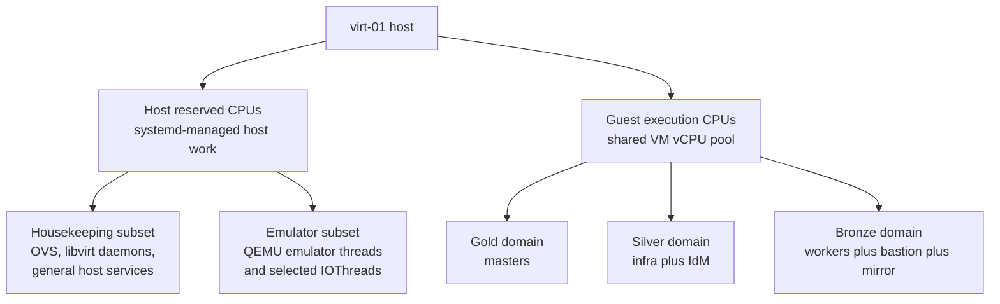
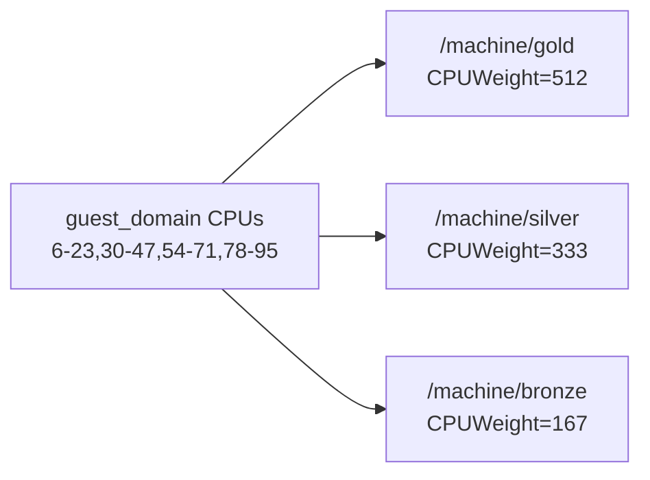
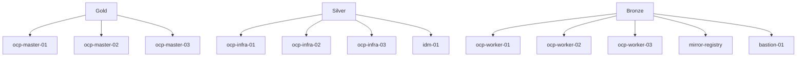
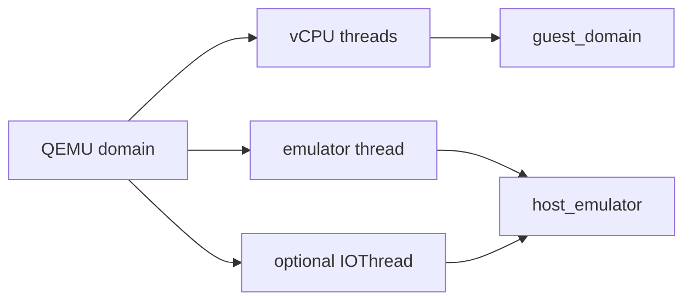

# Host Resource Management

Nearby docs:

<a href="./manual-process.md"><kbd>&nbsp;&nbsp;MANUAL PROCESS&nbsp;&nbsp;</kbd></a>
<a href="./network-topology.md"><kbd>&nbsp;&nbsp;NETWORK TOPOLOGY&nbsp;&nbsp;</kbd></a>
<a href="./openshift-cluster-matrix.md"><kbd>&nbsp;&nbsp;CLUSTER MATRIX&nbsp;&nbsp;</kbd></a>
<a href="./orchestration-guide.md"><kbd>&nbsp;&nbsp;ORCHESTRATION GUIDE&nbsp;&nbsp;</kbd></a>
<a href="#host-memory-oversubscription"><kbd>&nbsp;&nbsp;HOST MEMORY&nbsp;&nbsp;</kbd></a>
<a href="./README.md"><kbd>&nbsp;&nbsp;DOCS MAP&nbsp;&nbsp;</kbd></a>

This explains why `virt-01` is sized and scheduled the way it is,
especially once the host is busy.

The root model comes from Greg Procunier's cgroup-tiering thesis for
OpenStack:

- `https://github.com/gprocunier/openstack-cgroup-tiering`

This is the single-host version of that idea. The OpenStack-specific
scheduler and placement pieces are gone, but the core idea is still the same:

- keep host and guest execution domains distinct
- let guests compete in weighted performance domains instead of a flat pool
- preserve idle borrowing while making degradation behavior intentional

So the implementation here is best read as a fixed-workload, single-host
adaptation of the original cgroup-tiering model, not a separate design that
started from zero.

The practical goal:

- keep ordinary host-side work away from guest vCPU execution as much as
  practical
- let all guest vCPU threads compete in one shared execution pool
- make contention behavior intentional by placing guests into Gold, Silver, and
  Bronze performance domains instead of a flat scheduler pool

The implementation is built from standard Linux, systemd, libvirt, and
`virt-install` controls. The unusual part is the composition of those mundane
controls into a single scheduling policy.

## Current Implemented State

The current codebase intentionally keeps the guest-side policy stronger than
the host-side policy.

Implemented:

- `machine-gold.slice`, `machine-silver.slice`, and `machine-bronze.slice`
- manager-level systemd `CPUAffinity=` for host-managed services
- libvirt `partition` placement into the tier slices
- libvirt `shares`
- libvirt `vcpupin`
- libvirt `emulatorpin`
- libvirt `iothreadpin` for selected guests
- a dedicated host memory oversubscription role that applies:
  - `zram`
  - KSM
  - THP `madvise`

Intentionally not enabled by default:

- kernel boot arguments:
  - `systemd.cpu_affinity=...`
  - `irqaffinity=...`
- `IRQBALANCE_BANNED_CPULIST=...`

> [!NOTE]
> These stronger host-isolation controls were trialed and backed out. They
> made host-side admin workflows (SSH, Cockpit, OVS diagnostics) less
> predictable under load. The settled design keeps VM tiering but avoids
> over-constraining the entire host control plane.

## Host Memory Oversubscription

`playbooks/bootstrap/site.yml` applies a dedicated
`lab_host_memory_oversubscription` role immediately after
`lab_host_resource_management`.

That split is intentional:

- `lab_host_resource_management` defines the CPU pools and Gold/Silver/Bronze
  placement model
- `lab_host_memory_oversubscription` improves host RAM efficiency through three
  independent kernel mechanisms: zram compressed swap, Transparent Huge Pages,
  and Kernel Same-page Merging

This is not treated as fake RAM or as an excuse to reduce master or infra
sizing. The goal is to reclaim duplicate and cold guest memory on a host that
already showed low steady-state memory utilization with a fully deployed lab.

> [!WARNING]
> KSM and zram are host-kernel work, not Gold/Silver/Bronze work. The tiers
> still separate guest contention, but reclaim and compression can still steal
> CPU from the broader host pool unless you add more host-thread affinity
> controls later.

### Source Of Truth

The orchestration source of truth for memory policy is
`vars/global/host_memory_oversubscription.yml`.

Current defaults:

| Subsystem | Setting | Value | Purpose |
| --- | --- | --- | --- |
| zram | `enabled` | `true` | activate compressed swap device |
| zram | `device_name` | `zram0` | kernel device node |
| zram | `size` | `16G` | maximum uncompressed capacity of the device |
| zram | `compression_algorithm` | `zstd` | best ratio-to-speed tradeoff on modern kernels |
| zram | `swap_priority` | `100` | ensures zram is preferred over any physical swap |
| THP | `mode` | `madvise` | application-controlled huge page allocation |
| THP | `defrag_mode` | `madvise` | application-controlled compaction |
| KSM | `run` | `1` | scanner active |
| KSM | `pages_to_scan` | `1000` | pages examined per scan cycle |
| KSM | `sleep_millisecs` | `20` | pause between scan cycles |

The role defaults in `roles/lab_host_memory_oversubscription/defaults/main.yml`
set everything to disabled. The global vars file overrides those defaults to
enable the policy. This ensures that the role is always safe to include
and only activates when explicitly configured.

### How The Policy Is Applied

A single systemd oneshot service,
`calabi-host-memory-oversubscription.service`, applies all three subsystems at
boot. It uses `RemainAfterExit=yes` so systemd tracks the policy as active
for the lifetime of the host.

The service lifecycle for zram:

1. tear down any existing zram device (`swapoff`, `zramctl --reset`, `modprobe -r`)
2. load the zram module with `num_devices=1`
3. configure the device: `zramctl /dev/zram0 --algorithm zstd --size 16G`
4. format and activate: `mkswap`, `swapon --priority 100 --discard`

THP and KSM are applied in a follow-on `ExecStart` that writes directly to
`/sys/kernel/mm/transparent_hugepage/` and `/sys/kernel/mm/ksm/`.

A separate dedicated playbook, `playbooks/bootstrap/host-memory-oversubscription.yml`,
can apply or re-apply the memory policy independently without re-running the
full bootstrap sequence. This is the intended entry point for the Calabi Manager
"Host Memory Oversubscription" change scope.

### zram Compressed Swap

zram creates an in-memory block device that stores pages in compressed form. On
write, the kernel compresses the page into zram; on read, it decompresses on the
fly. The net effect is that cold anonymous pages that would otherwise consume
full-size RAM frames are stored at a fraction of their original size.

The `16G` size is the maximum uncompressed capacity of the device, not a
reservation. zram only consumes real RAM as pages are written into it. With
`zstd` compression the typical effective ratio on guest workloads is between
2:1 and 4:1, so 16G of logical swap capacity might cost 4-8G of physical RAM
when fully utilized.

> [!IMPORTANT]
> `16G` is a buffer, not a carved-out capacity loss. The host pays the
> physical cost only when memory pressure actually drives pages into swap.
> At steady state with low contention, zram consumes negligible real memory.

The swap priority of `100` ensures zram is always preferred over any physical
swap device. The `--discard` flag enables TRIM so that freed pages are
immediately released back to the host rather than lingering as stale compressed
blocks.

### Transparent Huge Pages

THP allows the kernel to back anonymous memory with 2 MiB pages instead of
the default 4 KiB pages. Fewer page-table entries means lower TLB miss rates
and measurable throughput improvement for memory-intensive workloads.

The policy sets THP to `madvise`, not `always`:

- `madvise` means the kernel only allocates huge pages when the application
  explicitly requests them via `madvise(MADV_HUGEPAGE)`. QEMU and the JVM both
  do this when configured to.
- `always` would apply huge pages to every anonymous mapping. That can trigger
  aggressive background compaction and allocation stalls that are worse than
  the TLB improvement.

The defrag mode is also set to `madvise` for the same reason: compaction
only runs when an application has signaled that it wants huge pages. This
avoids the pathological case where `khugepaged` burns CPU compacting memory
that no process actually benefits from.

> [!NOTE]
> For this workload, `madvise` is the conservative and correct default. The
> guest kernels inside each VM make their own independent THP decisions. The
> host-level setting controls the outer hypervisor kernel behavior only.

### Kernel Same-page Merging

KSM is a kernel thread (`ksmd`) that scans anonymous pages across all processes
looking for byte-identical content. When it finds duplicates, it merges them
into a single copy-on-write page, freeing the redundant frames.

This is especially effective in a nested virtualization environment where
multiple guests run identical operating system images. The RHEL CoreOS nodes
(`ocp-master`, `ocp-infra`, `ocp-worker`) share a large fraction of their
kernel and base-OS memory footprint. KSM finds and deduplicates those pages
without any guest-side configuration.

Current scan settings:

- `pages_to_scan = 1000`: examine 1000 pages per scan cycle
- `sleep_millisecs = 20`: pause 20 ms between cycles

These are deliberately conservative. Aggressive settings (higher page count,
shorter sleep) merge faster but consume more host CPU. The current values
prioritize low steady-state CPU overhead over fast initial convergence.

KSM convergence behavior:

- **First scan pass**: slow. The scanner must build its internal red-black tree
  of page checksums across all guest memory. On a fully deployed lab this can
  take minutes to hours depending on total guest memory.
- **Steady state**: cheap. Once the initial tree is built, incremental scans
  only process new or changed pages. CPU cost drops to near zero when guest
  memory is stable.
- **After guest reboot or migration**: the scanner re-examines changed pages.
  A full cluster reboot temporarily increases KSM CPU usage until the new
  steady state is reached.

> [!NOTE]
> The policy is most valuable in low-to-medium contention: it gives the kernel
> a cheaper way to reclaim duplicate memory before direct reclaim gets
> expensive. It is not meant to rescue sustained high contention.

### Why Bronze Is The Elastic Tier

The Bronze domain is already the least latency-sensitive part of the guest
estate:

- `ocp-worker-01..03`
- `bastion-01`
- `mirror-registry`

That makes Bronze the correct place to absorb most elasticity pressure before
touching masters or infra. The intended sizing policy is:

- keep masters stable
- keep infra stable
- use workers as the first expansion or contraction lever

### CPU Placement Caveat

KSM and reclaim activity are host/kernel work, not guest-tier work.

So while Gold/Silver/Bronze still model guest-vs-guest contention, enabling
`zram`, KSM, and THP does not automatically pin those host-kernel threads into
one guest tier. The current role improves memory efficiency without claiming
that all reclaim and merge work is strictly isolated inside `host_reserved`.

### Memory Operational Validation

After bootstrap, validate the memory policy from the host:

```bash
# Service state
systemctl is-enabled calabi-host-memory-oversubscription.service
systemctl is-active calabi-host-memory-oversubscription.service

# zram device
zramctl
swapon --show

# THP mode
cat /sys/kernel/mm/transparent_hugepage/enabled
cat /sys/kernel/mm/transparent_hugepage/defrag

# KSM state
cat /sys/kernel/mm/ksm/run
cat /sys/kernel/mm/ksm/pages_to_scan
cat /sys/kernel/mm/ksm/sleep_millisecs

# KSM effectiveness
cat /sys/kernel/mm/ksm/pages_shared
cat /sys/kernel/mm/ksm/pages_sharing
cat /sys/kernel/mm/ksm/pages_unshared
```

Expected current behavior:

- service is enabled and active
- `zramctl` shows `/dev/zram0` with `zstd` algorithm and `16G` disk size
- `swapon` shows `/dev/zram0` at priority `100`
- THP enabled shows `[madvise]` (bracketed = active selection)
- THP defrag shows `[madvise]`
- KSM `run` is `1`
- `pages_shared` and `pages_sharing` grow over time as guests stabilize

The project includes a monitoring script for continuous observation:

```bash
scripts/host-memory-overcommit-status.py --host <virt-01-ip> --user ec2-user
```

This queries zram usage, KSM deduplication savings, per-guest memory
allocation, and tier-level totals. Use `--watch 30` for a live refresh or
`--delta 60` to capture a before-and-after snapshot across an interval.

### Signals That Memory Policy Needs Adjustment

zram under-sized:

- `zramctl` shows the device near its configured size limit
- swap utilization stays persistently high with poor compression ratio
- consider increasing `size` or investigating which guest is driving pressure

zram over-sized:

- the device rarely holds more than a few hundred MiB
- the host never enters memory pressure
- not harmful, but the 16G buffer is idle weight in the config

KSM scan rate too conservative:

- `pages_unshared` remains high relative to `pages_sharing` for extended
  periods after guest deployment
- initial convergence takes unreasonably long
- consider increasing `pages_to_scan` to `2000-4000` and observing CPU impact

KSM scan rate too aggressive:

- `ksmd` appears in `top` consuming visible CPU during steady state
- host-side CPU pressure appears on the reserved pool
- reduce `pages_to_scan` or increase `sleep_millisecs`

THP causing compaction pressure:

- `khugepaged` or `kcompactd` consuming persistent CPU
- this is unlikely with `madvise` mode but can appear if guest kernels
  aggressively request huge pages via virtio-balloon or similar
- switching to `never` is a safe fallback that disables THP entirely

## Design Summary



At runtime:

- host services are constrained by manager `CPUAffinity` to the reserved pool
- guest vCPU threads are pinned to the guest execution pool
- QEMU emulator threads are pinned to the emulator subset of the reserved pool
- systemd tier slices provide relative weight when tier siblings contend

## Hardware Topology

`virt-01` currently runs on AWS `m5.metal`:

- 2 sockets / 2 NUMA nodes
- 24 physical cores per socket
- 2 SMT threads per core
- 96 logical CPUs total

The CPU numbering is regular:

- socket 0 primary threads: `0-23`
- socket 0 SMT siblings: `48-71`
- socket 1 primary threads: `24-47`
- socket 1 SMT siblings: `72-95`

Examples:

- core pair `0,48`
- core pair `5,53`
- core pair `24,72`
- core pair `47,95`

That regularity matters because the policy always reserves or allocates whole
SMT core pairs, never isolated sibling threads.

## Current CPU Pools

The orchestration source of truth is
`vars/global/host_resource_management.yml`.

Current pool definitions:

- `host_reserved`: `0-5,24-29,48-53,72-77`
- `host_housekeeping`: `0-1,24-25,48-49,72-73`
- `host_emulator`: `2-5,26-29,50-53,74-77`
- `guest_domain`: `6-23,30-47,54-71,78-95`

Pool meaning:

| Pool | CPUs | Physical cores | Purpose |
| --- | --- | --- | --- |
| `host_reserved` | `0-5,24-29,48-53,72-77` | 12 | effective host pool exposed to manager `CPUAffinity` |
| `host_housekeeping` | `0-1,24-25,48-49,72-73` | 4 | host networking, OVS, libvirt daemons, general userspace host work |
| `host_emulator` | `2-5,26-29,50-53,74-77` | 8 | QEMU emulator threads and explicit IOThreads |
| `guest_domain` | `6-23,30-47,54-71,78-95` | 36 | shared guest vCPU execution pool |

This preserves:

- `6` physical host cores per socket
- `18` physical guest cores per socket

Or, across the full host:

- `12` physical / `24` logical CPUs for host work
- `36` physical / `72` logical CPUs for guest vCPU execution

### Current Host Policy

The host policy deliberately stops short of hard scheduler isolation:

- systemd manager `CPUAffinity` is enabled for `host_reserved`
- dedicated tier slices are installed and weighted
- no kernel affinity boot args are managed by default
- no guest-domain `irqbalance` ban is managed by default

In other words, the host keeps a preferred execution pool, but the design does
not currently try to force early-boot IRQ and scheduler behavior into a narrow
housekeeping regime.

## Performance Domains

All guest vCPU threads share the same `guest_domain` cpuset. The Gold, Silver,
and Bronze domains are not separate cpusets; they are sibling scheduling
domains with different relative weight.

| Tier | systemd partition | `CPUWeight` | libvirt `shares` | Intended class |
| --- | --- | --- | --- | --- |
| Gold | `/machine/gold` | `512` | `512` | control plane |
| Silver | `/machine/silver` | `333` | `333` | infra and support services |
| Bronze | `/machine/bronze` | `167` | `167` | general workload capacity |



> [!IMPORTANT]
> These are relative shares under contention, not hard reservations. Idle CPU
> in Gold or Silver can still be borrowed by Bronze. The model improves
> graceful degradation; it does not create deterministic latency guarantees.

## Guest Tier Mapping

Current role-to-tier mapping:

| Guest class | Tier | Reason |
| --- | --- | --- |
| `ocp-master-01..03` | Gold | API, etcd, control-plane stability |
| `ocp-infra-01..03` | Silver | ingress, monitoring, registry, ODF-adjacent workload |
| `idm-01` | Silver | authentication, DNS, CA, bastion dependency |
| `ocp-worker-01..03` | Bronze | least critical general scheduling pool |
| `mirror-registry` | Bronze | important, but deferrable relative to cluster control plane |
| `bastion-01` | Bronze | operator access host, but not part of cluster control path |



## Thread Placement Model

The thread-placement model is as important as the weights.



Current intent by thread class:

- vCPU threads:
  - pinned to `guest_domain`
- emulator thread:
  - pinned to `host_emulator`
- explicit IOThread:
  - pinned to `host_emulator`
- ordinary host services:
  - inherit the manager-level `host_reserved` mask

The tier slices intentionally do not set `AllowedCPUs=`. CPU placement is
controlled by libvirt thread pinning so that guest execution can live on
`guest_domain` while emulator-side noise remains on `host_emulator`.

## Current `virt-install` Policy

Guest creation uses `virt-install` directly. For each VM, the orchestration
derives the tier from inventory and then applies:

- `--resource partition=...`
- `--cputune shares=...`
- `vcpupinN.cpuset={{ guest_domain }}`
- `emulatorpin.cpuset={{ host_emulator }}`
- `--iothreads ...` plus `iothreadpin...` when the guest is marked for
  explicit IOThreads

Selected guests currently receive one IOThread:

- `ocp-infra-01`
- `ocp-infra-02`
- `ocp-infra-03`
- `mirror-registry`

That is a pragmatic first pass for storage-heavy guests. It is not a claim that
all host-side IO noise has been fully isolated.

## Current Capacity Picture On `m5.metal`

The latest fully validated end-to-end cluster baseline used workers at `3 x 4
vCPU`. The current repo default now moves workers to `3 x 8 vCPU` so the Bronze
performance domain can absorb more worker scheduling pressure without
immediately jumping to the more aggressive `3 x 12` shape.

Present configured guest vCPU counts for the current repo default:

| Class | Count | Per guest | Total |
| --- | --- | --- | --- |
| masters | 3 | 8 | 24 |
| infra | 3 | 16 | 48 |
| workers | 3 | 8 | 24 |
| IdM | 1 | 2 | 2 |
| mirror-registry | 1 | 4 | 4 |
| bastion | 1 | 4 | 4 |
| total | 12 guests | - | 106 |

Against the current `guest_domain` size:

- guest execution pool: `72` logical CPUs
- current aggregate guest vCPU count: `106`
- current aggregate guest-to-pool ratio: about `1.47:1`

Useful planning checkpoints:

| Scenario | Worker shape | Bronze total | Total guest vCPU | Ratio vs 72-logical guest pool | Recommendation |
| --- | --- | --- | --- | --- | --- |
| historical validated baseline | `3 x 4` | 20 | 94 | `1.31:1` | known good baseline before worker uplift |
| conservative uplift | `3 x 6` | 26 | 100 | `1.39:1` | safe, but modest payoff |
| current repo default | `3 x 8` | 32 | 106 | `1.47:1` | chosen default |
| aggressive intermediate | `3 x 10` | 38 | 112 | `1.56:1` | viable, but less clean operationally |
| later validation target | `3 x 12` | 44 | 118 | `1.64:1` | only after measurement |

Current rationale for `3 x 8` workers:

- doubles worker vCPU headroom relative to the historical `3 x 4` layout
- gives OpenShift materially larger worker nodes without changing the Gold and
  Silver shapes
- keeps Bronze at `32 vCPU`, still well below one full `72`-logical
  guest-execution pool
- preserves a later path to `3 x 12` if host pressure, `%steal`, and cluster
  behavior stay healthy

The practical strategy is:

- treat `3 x 8` as the current default
- validate cluster behavior there first
- consider `3 x 12` only after real measurements

## Resizing Guidance For Other Metal Hosts

> [!WARNING]
> The design is portable, but the CPU sets are not. If you move to a different
> metal host shape, you must recompute every pool mask. Copy-pasting the
> `m5.metal` values onto a different topology will produce wrong pinning.

### Invariants To Keep

- reserve whole physical cores, not lone SMT siblings
- keep the reserved pool symmetric across sockets
- keep one shared guest vCPU pool
- use Gold, Silver, and Bronze as sibling weighted domains inside that one
  guest pool
- keep emulator threads out of the guest pool

### Starting Method

For a new host:

1. Determine:
   - sockets
   - physical cores per socket
   - SMT sibling numbering
2. Choose a host reservation per socket as whole physical cores.
3. Split that reservation into:
   - `2` housekeeping cores per socket
   - the remainder as emulator/helper cores per socket
4. Allocate all remaining whole cores to `guest_domain`.
5. Recompute:
   - host CPU masks
   - guest CPU mask
   - effective guest-pool logical CPU count
   - projected guest-vCPU oversubscription ratios

### Reasonable Starting Reservations

| Host shape | Starting host reservation per socket | Notes |
| --- | --- | --- |
| `<= 16` physical cores/socket | `4` | `2` housekeeping + `2` emulator is the minimum sensible split |
| `24` physical cores/socket | `6` | current `m5.metal` design: `2` housekeeping + `4` emulator |
| `>= 32` physical cores/socket | `6` or `8` | start at `6`; move to `8` only if real host-side pressure justifies it |

### When The Host Gets Smaller

On a smaller metal host, reduce guest ambition before weakening the host pool
too aggressively.

Preferred order of compromise:

1. keep masters stable
2. reduce worker target growth
3. reduce support-guest size where tolerable
4. only then consider squeezing the host reservation further

### When The Host Gets Larger

On a larger metal host, grow the guest pool first. Do not change the tier
weights just because more cores are available.

Preferred order of expansion:

1. increase `guest_domain`
2. validate host-side pressure remains healthy
3. increase worker vCPUs
4. rebalance weights only if measurement says the contention model is wrong

## Operational Validation

After bootstrap and guest creation, validate both the host policy and the guest
placement.

Host checks:

```bash
grep -E '^(DefaultCPUAccounting|CPUAffinity)=' \
  /etc/systemd/system.conf.d/90-aws-metal-openshift-demo-host-resource-management.conf

systemctl show machine-gold.slice machine-silver.slice machine-bronze.slice \
  -p CPUAccounting -p CPUWeight

grep Cpus_allowed_list /proc/1/status

cat /proc/cmdline
```

Expected current behavior:

- manager `CPUAffinity` present
- tier slices present with expected weights
- PID 1 confined to `host_reserved`
- no `systemd.cpu_affinity=` or `irqaffinity=` boot args by default

Guest placement checks:

```bash
virsh dumpxml idm-01.workshop.lan | egrep 'partition|shares|iothreads'
virsh vcpupin idm-01.workshop.lan
virsh emulatorpin idm-01.workshop.lan
systemctl status machine-silver.slice
```

Expected current behavior:

- persistent XML contains the tier partition
- persistent XML contains the expected `shares`
- vCPU pinning lands in `guest_domain`
- emulator pinning lands in `host_emulator`

## Signals That The Model Needs Adjustment

Host reservation too small:

- `sshd` and Cockpit become sticky under modest admin activity
- OVS or libvirt daemons show persistent pressure on reserved CPUs
- emulator-thread contention appears during IO-heavy guest activity

Host reservation too large:

- guest pool is undersized relative to lab demand
- workers remain cramped even though host services stay quiet
- `%steal` rises while host-side reserved CPUs remain mostly idle

Tier weights need reevaluation:

- masters are still impacted during cluster churn
- infra services dominate at the expense of worker throughput
- Bronze never benefits from obvious idle capacity above it

## Related Documents

- <a href="./automation-flow.md"><kbd>AUTOMATION FLOW</kbd></a>
- <a href="./orchestration-guide.md"><kbd>ORCHESTRATION GUIDE</kbd></a>
- <a href="./manual-process.md"><kbd>MANUAL PROCESS</kbd></a>
- `<project-root>/../the-story-so-far.md`
