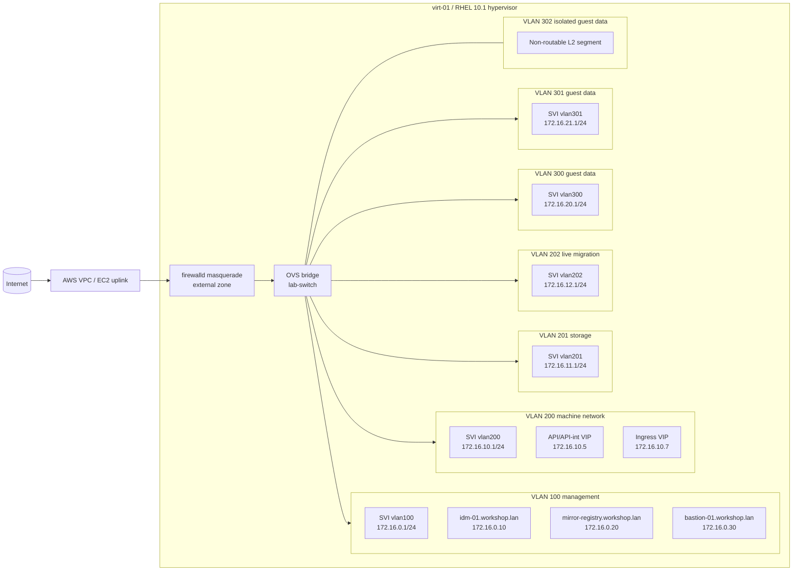
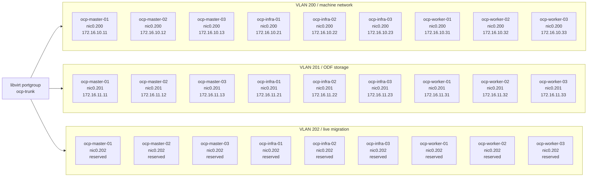

# Network Topology

Nearby docs:

<a href="./iaas-resource-model.md"><kbd>&nbsp;&nbsp;IAAS MODEL&nbsp;&nbsp;</kbd></a>
<a href="./openshift-cluster-matrix.md"><kbd>&nbsp;&nbsp;CLUSTER MATRIX&nbsp;&nbsp;</kbd></a>
<a href="./host-resource-management.md"><kbd>&nbsp;&nbsp;RESOURCE MANAGEMENT&nbsp;&nbsp;</kbd></a>
<a href="./odf-declarative-plan.md"><kbd>&nbsp;&nbsp;ODF PLAN&nbsp;&nbsp;</kbd></a>
<a href="./README.md"><kbd>&nbsp;&nbsp;DOCS MAP&nbsp;&nbsp;</kbd></a>

This page shows the network shape the lab is trying to reproduce on one host.
The point is not just connectivity. The topology needs to stay relatable to a
real multi-host deployment.

The VLAN count is deliberate. The lab is not trying to prove that OpenShift can
boot with the fewest possible segments. It is trying to preserve the service
boundaries that matter in a real environment:

- management traffic stays separate from cluster traffic
- the machine network remains distinct from storage and migration paths
- guest data VLANs can be modeled without pretending they are all the same
- a non-routable segment still exists for cases where pure layer-2 adjacency is
  the point

That is why this page matters even on one host. The value is not the number of
interfaces. The value is that the network shape is still something you could
explain to a platform or network team without apologizing for it.

## Why The VLAN Model Looks Like This

`VLAN 100` is the management plane. It carries the support services and the
operator-facing entrypoints that make the rest of the lab possible: `idm-01`,
`mirror-registry`, `bastion-01`, and the routed SVI on `virt-01`.

`VLAN 200` is the cluster machine network. This is where the control-plane and
worker node identities live, and where the API and ingress VIPs belong.
Keeping this separate from management makes the cluster look like a real
deployment instead of a pile of hosts sharing one flat access network.

`VLAN 201` exists because storage traffic is worth keeping explicit. ODF and
Ceph-adjacent designs are easier to reason about when storage is not collapsed
into the same network as everything else.

`VLAN 202` is reserved for live migration style traffic. Even when that path is
not heavily exercised yet, keeping it in the design prevents the lab from
teaching the wrong lesson about where migration traffic should live.

`VLANs 300` and `301` are guest data segments. They are there to keep room for
real application or tenant-style data paths instead of forcing every workload
onto the machine or management networks.

`VLAN 302` stays non-routable on purpose. Some network stories are about pure
L2 adjacency, isolation, or broadcast domain behavior. A routed SVI there would
change the meaning of the segment.

## Infrastructure View

## OpenShift Guest VLAN View

