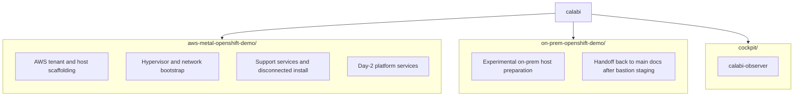

# Orchestration Guide

Nearby docs:

<a href="./prerequisites.md"><kbd>&nbsp;&nbsp;PREREQUISITES&nbsp;&nbsp;</kbd></a>
<a href="./automation-flow.md"><kbd>&nbsp;&nbsp;AUTOMATION FLOW&nbsp;&nbsp;</kbd></a>
<a href="./orchestration-plumbing.md"><kbd>&nbsp;&nbsp;ORCHESTRATION PLUMBING&nbsp;&nbsp;</kbd></a>
<a href="./authentication-model.md"><kbd>&nbsp;&nbsp;AUTH MODEL&nbsp;&nbsp;</kbd></a>
<a href="./ad-idm-policy-model.md"><kbd>&nbsp;&nbsp;AD / IDM POLICY MODEL&nbsp;&nbsp;</kbd></a>
<a href="./manual-process.md"><kbd>&nbsp;&nbsp;MANUAL PROCESS&nbsp;&nbsp;</kbd></a>
<a href="./investigating.md"><kbd>&nbsp;&nbsp;INVESTIGATING&nbsp;&nbsp;</kbd></a>
<a href="./secrets-and-sanitization.md"><kbd>&nbsp;&nbsp;SECRETS&nbsp;&nbsp;</kbd></a>
<a href="./README.md"><kbd>&nbsp;&nbsp;DOCS MAP&nbsp;&nbsp;</kbd></a>

Come here when you need to answer questions like:

- which playbook owns this phase?
- which role is doing the real work?
- where should a fix land?

It maps the Ansible side of the repo: role boundaries, critical tasks, and the
workflows that matter during build, teardown, and disconnected OpenShift
preparation.

Keep these nearby while you use this page:

- <a href="./automation-flow.md"><kbd>AUTOMATION FLOW</kbd></a> for run order and lifecycle
- <a href="./orchestration-plumbing.md"><kbd>ORCHESTRATION PLUMBING</kbd></a> for workstation-to-bastion handoff, runner files, and dashboard telemetry
- <a href="./authentication-model.md"><kbd>AUTH MODEL</kbd></a> for the formal current-state identity and authorization architecture
- <a href="./ad-idm-policy-model.md"><kbd>AD / IDM POLICY MODEL</kbd></a> for the planned future AD-source-of-truth authorization model
- <a href="./iaas-resource-model.md"><kbd>IAAS MODEL</kbd></a> for AWS and cloud-init design
- <a href="./host-resource-management.md"><kbd>RESOURCE MANAGEMENT</kbd></a> for guest tiers and CPU pools
- <a href="./openshift-cluster-matrix.md"><kbd>CLUSTER MATRIX</kbd></a> for per-node identities and sizing

## Current Project Layout

Use this section when you need the maintainer view of the repo shape rather than
the operator entry path. The supported deployment path still starts in
<a href="./prerequisites.md"><kbd>PREREQUISITES</kbd></a>.

## Table Of Contents

Use this when you need to answer "where should I look" before you answer
"what exactly is broken."

- [Top-Level Playbooks](#top-level-playbooks)
- [Data Files](#data-files)
- [Project Dependencies](#project-dependencies)
- [Host Roles](#host-roles)
- [AD Roles](#ad-roles)
- [IDM Roles](#idm-roles)
- [OpenShift Cluster Roles](#openshift-cluster-roles)
- [Mirror Registry Roles](#mirror-registry-roles)
- [Validation Practices In Use](#validation-practices-in-use)
- [Known Gaps](#known-gaps)

## Top-Level Playbooks

The canonical operator entrypoints are:

- `./scripts/run_local_playbook.sh`
  <a href="../playbooks/site-bootstrap.yml"><kbd>playbooks/site-bootstrap.yml</kbd></a>
- `./scripts/run_remote_bastion_playbook.sh`
  <a href="../playbooks/site-lab.yml"><kbd>playbooks/site-lab.yml</kbd></a>

The top-level playbook artifacts behind those entrypoints are:

- `playbooks/site-bootstrap.yml`
- `playbooks/site-lab.yml`

The CloudFormation stack split, guest-disk inventory model, and first-boot
cloud-init behavior are documented in
<a href="./iaas-resource-model.md"><kbd>IAAS MODEL</kbd></a>. This page stays focused on
which playbook or role owns each part once the substrate is already there.

### `playbooks/site-bootstrap.yml`

Purpose:

- run the outside-facing bootstrap phase from the operator desktop

Execution model:

- imports:
  - `playbooks/bootstrap/site.yml`
  - `playbooks/bootstrap/bastion.yml`
  - `playbooks/bootstrap/bastion-stage.yml`

### `playbooks/site-lab.yml`

Purpose:

- run the inside-facing lab build from the bastion

Execution model:

- imports:
  - `playbooks/bootstrap/ad-server.yml`
  - `playbooks/bootstrap/idm.yml`
  - `playbooks/bootstrap/idm-ad-trust.yml`
  - `playbooks/bootstrap/bastion-join.yml`
  - `playbooks/lab/mirror-registry.yml`
  - `playbooks/lab/openshift-dns.yml`
  - `playbooks/cluster/openshift-installer-binaries.yml`
  - `playbooks/cluster/openshift-install-artifacts.yml`
  - `playbooks/cluster/openshift-agent-media.yml`
  - `playbooks/cluster/openshift-cluster.yml`
  - `playbooks/cluster/openshift-install-wait.yml`
  - `playbooks/day2/openshift-post-install-validate.yml`
  - `playbooks/day2/openshift-post-install.yml`
- intended to run on `bastion-01`, not on the operator workstation
- `playbooks/bootstrap/ad-server.yml` is optional and exits early unless
  `lab_build_ad_server=true`
- for resilient long-running execution, the project provides:
  - `scripts/run_bastion_playbook.sh`
  - which writes PID, log, and exit-code state under
    `/var/tmp/bastion-playbooks/`
- support VMs (`ad-01`, `idm-01`, `bastion-01`, and `mirror-registry`) default to
  preserving existing disks and libvirt domains on rerun
- a true fresh support-services rebuild now means both removing the support VMs
  and wiping their backing block devices before replaying
  `./scripts/run_local_playbook.sh`
  <a href="../playbooks/site-bootstrap.yml"><kbd>playbooks/site-bootstrap.yml</kbd></a>
- the mirror-registry phase now caches successful mirror completion for the
  rendered content set and skips the expensive `oc-mirror` work on rerun unless
  forced
- the cluster VMs now default to reuse on rerun; destructive cluster rebuilds
  are an explicit cleanup action rather than the normal replay path
- bastion staging ensures the staged `generated/` workspace is writable by
  `cloud-user` so repeated installer renders do not fail on ownership drift
- bastion staging also seeds a small managed `/etc/hosts` fallback for the
  bootstrap-critical support hostnames and cluster API endpoints, then verifies
  those names with `getent` before the long-running orchestration starts
- the guest-build playbooks later in this phase consume the same
  `host_resource_management` data loaded during bootstrap

### `playbooks/bootstrap/site.yml`

Purpose:

- prepare the AWS metal hypervisor
- install virtualization and networking prerequisites
- build the `lab-switch` Open vSwitch and libvirt topology
- configure host routing and NAT

Execution model:

- runs against the metal host group
- loads `vars/global/lab_switch_ports.yml`
- waits for the full expected disk inventory before host configuration begins
- registers the host with RHSM, disables RHUI repos, and enables CDN repos
  required for RHEL virtualization and Open vSwitch content
- composes five roles in order:
  - `lab_host_base`
  - `lab_host_resource_management`
  - `lab_switch`
  - `lab_firewall`
  - `lab_libvirt`

Important behavior:

- loads `vars/global/host_resource_management.yml`
- installs `machine-gold.slice`, `machine-silver.slice`, and
  `machine-bronze.slice`
- applies manager-level systemd `CPUAffinity` for the reserved host CPU pool
- intentionally does not enable kernel affinity boot args or
  `IRQBALANCE_BANNED_CPULIST` by default
- defines the CPU-pool data later consumed by `virt-install` guest definitions

### `playbooks/bootstrap/ad-server.yml`

Purpose:

- provision `ad-01.corp.lan`
- configure the guest as the optional lab AD DS / AD CS server

Execution model:

- first play runs on the hypervisor and creates the Windows guest with
  `ad_server`
- second play waits for the first WinRM listener
- third play configures the guest with `ad_server_guest`
- final play removes installation media from persistent XML
- in the validated flow, bastion reaches the Windows guest directly on VLAN 100
  with WinRM; it does not proxy back through the operator workstation

Important behavior:

- default-disabled behind `lab_build_ad_server: false`
- uses an EBS-backed system disk at `/dev/ebs/ad-01`
- uses Windows Server 2025 media plus `virtio-win.iso`
- loads only the boot-critical storage and network drivers during Setup
- installs the remaining virtio drivers and `virtio-win-gt-x64.msi`
  post-install over WinRM
- configures:
  - AD DS
  - AD CS
  - Web Enrollment
  - demo users and groups for the trust-oriented identity story
- exports the AD root CA after successful configuration

> [!NOTE]
> The bastion-first AD build is validated. The deeper IdM trust and
> AD-root/IdM-intermediate PKI path is still follow-on work, not the default
> documented golden path.

### `playbooks/bootstrap/idm.yml`

Purpose:

- provision `idm-01.workshop.lan`
- configure the guest as the lab IdM/DNS/CA/KRA server

Execution model:

- first play runs on the hypervisor and creates the VM with the `idm` role
- then `add_host` registers the guest dynamically
- second play waits for SSH and configures the guest with `idm_guest`
- in the validated bastion-first flow, this playbook runs from the bastion
  after bastion staging and after the optional AD build when enabled

Important behavior:

- applies the Silver guest policy described in
  <a href="./host-resource-management.md"><kbd>RESOURCE MANAGEMENT</kbd></a>
- registers the guest with RHSM and Red Hat Insights
- installs the IPA server with the `freeipa.ansible_freeipa.ipaserver` role
- enables KRA through the FreeIPA role rather than a hand-driven CLI step
- manages users, groups, password policies, and sudo rules through FreeIPA
  modules
- enables `authselect` with:
  - `with-tlog`
  - `with-mkhomedir`
  - `with-sudo`
- enables `oddjobd` so domain-user home directories are created on first login

### `playbooks/bootstrap/idm-ad-trust.yml`

Purpose:

- configure the optional IdM to AD trust after `idm-01` and the optional AD VM
  are both available

Execution model:

- first registers the IdM guest and AD guest as temporary inventory hosts
- configures the AD conditional forwarder for `workshop.lan` from the Windows
  side before touching the IdM trust path
- then runs the `idm_ad_trust` role on `idm-01` from the bastion-side flow
- exits early unless both `lab_build_ad_server=true` and the AD-trust feature
  are enabled

Important behavior:

- enables IdM AD-trust server support and the IPA forward zone for the AD
  domain
- validates both host and LDAP SRV lookups through the new forward zone before
  creating the trust
- creates the AD trust with bounded retry around transient oddjob/cache issues
- creates the configured IdM external groups and nests them into the target
  local IdM policy groups

### `playbooks/bootstrap/bastion.yml`

Purpose:

- provision `bastion-01.workshop.lan`
- create the execution host for the rest of the lab

Execution model:

- first play runs on the hypervisor and creates the VM with the `bastion` role
- then `add_host` registers the guest dynamically
- second play waits for SSH and configures the guest with `bastion_guest`

Important behavior:

- applies the Bronze guest policy described in
  <a href="./host-resource-management.md"><kbd>RESOURCE MANAGEMENT</kbd></a>
- registers the guest with RHSM and Red Hat Insights
- updates all guest packages and reboots when needed
- installs the bastion management package set, including:
  - `cockpit-files`
  - `cockpit-packagekit`
  - `cockpit-podman`
  - `cockpit-session-recording`
  - `cockpit-image-builder`
  - `pcp`
  - `pcp-system-tools`
- enables:
  - `cockpit.socket`
  - `osbuild-composer.socket`
  - `pmcd`
  - `pmlogger`
  - `pmproxy`
- enables `oddjobd`
- intentionally does not join IdM during the initial bastion build
- leaves IdM enrollment to `playbooks/bootstrap/bastion-join.yml` after IdM is
  available

### `playbooks/bootstrap/bastion-stage.yml`

Purpose:

- stage the repo and execution inputs onto the bastion

Execution model:

- first play registers the bastion through the hypervisor using `ProxyCommand`
- second play:
  - installs execution prerequisites on the bastion
  - synchronizes the repo to the bastion with `rsync`
  - preserves bastion-side `generated/` content during refresh
  - stages the pull secret and hypervisor SSH key
  - renders a bastion-local inventory for `172.16.0.1`
  - installs Ansible collections
  - installs pip requirements such as `pywinrm` so bastion-native Windows
    orchestration can talk to `ad-01`
  - installs `/etc/profile.d/openshift-bastion.sh`
  - publishes a stable `generated/tools/current` symlink
  - creates `$HOME/bin` and `$HOME/etc` link sets for `cloud-user` and current
    members of IdM `access-linux-admin`
  - seeds the same helper layout into `/etc/skel` for future admin logins
  - verifies SSH from bastion to `virt-01`

Operator helper:

- `scripts/run_local_playbook.sh`
  - launches workstation-side playbooks with tracked PID, log, and exit-code
    state under `~/.local/state/calabi-playbooks/`
  - this is the preferred way to track `site-bootstrap.yml` from the operator
    workstation
- `scripts/run_remote_bastion_playbook.sh`
  - refreshes bastion staging by running `playbooks/bootstrap/bastion-stage.yml`
  - records the workstation-side validation and bastion-staging phase under
    `~/.local/state/calabi-playbooks/`, then invokes the staged
    `scripts/run_bastion_playbook.sh` helper on the bastion
  - this is the preferred way to rerun bastion-native playbooks after local
    repository changes
- `scripts/lab-dashboard.sh`
  - runs on either the operator workstation or bastion
  - on the workstation, it reads local tracked state first and then switches to
    bastion-side runner state after handoff metadata appears
  - if `site-lab.yml` is still in local validation or `bastion-stage.yml`, the
    bastion dashboard will correctly show nothing yet because the bastion-side
    runner does not exist until after handoff

Day-2 rerun behavior:

- `playbooks/day2/openshift-post-install.yml` now probes the major post-install
  phases before including their roles
- healthy phases are skipped by default on rerun instead of being reapplied
- the guarded phases include:
  - disconnected OperatorHub
  - infra conversion
  - IdM ingress certs
  - breakglass auth
  - NMState
  - ODF
  - Keycloak
  - OIDC auth
  - optional LDAP auth and group sync
  - OpenShift Virtualization
  - Pipelines
  - Web Terminal
  - AAP
  - Network Observability
- destructive ODF recovery is force-only:
  - `-e openshift_post_install_force_odf_rebuild=true`
  - legacy alias: `-e openshift_post_install_odf_force_osd_device_reset=true`

The shell profile installed by bastion-stage:

- prepends `$HOME/bin` and `generated/tools/current/bin` to `PATH`
- exports `KUBECONFIG_ADMIN=$HOME/etc/kubeconfig.local`
- exports `KUBECONFIG=$HOME/etc/kubeconfig` when that writable working copy
  exists, otherwise falls back to `KUBECONFIG_ADMIN`
- keeps the generated cluster artifact kubeconfig as the source snapshot rather
  than the default mutable login target
- leaves early bastion logins clean even before OpenShift auth artifacts exist

### `playbooks/bootstrap/bastion-join.yml`

Purpose:

- join the already-built bastion to IdM after identity services are available

Execution model:

- runs directly on `openshift_bastion`
- waits for the IdM guest to answer on SSH first
- reuses the existing `bastion_guest` role in join mode rather than creating a
  second bastion-enrollment implementation

Important behavior:

- refreshes the active IdM CA before enrollment
- runs the FreeIPA client role only when enrollment is required
- does not perform a general guest `dnf update` or reboot; that behavior now
  stays in the initial `site-bootstrap.yml` provisioning path so `site-lab.yml`
  does not power off its own control host mid-run
- enables `authselect` with:
  - `with-mkhomedir`
  - `with-sudo`
- leaves the bastion ready for IdM-backed operator access before
  `mirror-registry` and cluster work begin

## AD Roles

### `roles/ad_server`

Purpose:

- create, reset, and boot the Windows AD VM on the hypervisor

Important behavior:

- stages the Windows ISO, `virtio-win.iso`, and generated unattend media under
  `/var/lib/aws-metal-openshift-demo/ad-01/`
- uses `/dev/ebs/ad-01` for the system disk
- keeps the Windows install path deterministic enough for reruns by isolating
  boot-critical drivers from later guest-driver work

### `roles/ad_server_guest`

Purpose:

- configure Windows after the first WinRM listener is available

Important behavior:

- installs remaining virtio drivers after the OS is reachable
- installs and starts the QEMU guest agent
- promotes the server to a DC
- configures AD CS and Web Enrollment
- seeds demo users and groups
- exports the root CA

### `playbooks/lab/mirror-registry.yml`

Purpose:

- provision `mirror-registry.workshop.lan`
- join it to IdM
- install and configure the local mirror registry
- prepare and optionally execute disconnected OpenShift content mirroring

Execution model:

- first play runs on the hypervisor and creates the VM with `mirror_registry`
- it waits for `idm-01` first because the guest is domain-joined later
- then `add_host` registers the guest dynamically
- second play waits for SSH, gathers facts, and applies `mirror_registry_guest`
- when run from the bastion, guest communication is direct to `172.16.0.20`
  across VLAN 100; it does not proxy back through `virt-01`

Important behavior:

- applies the Bronze guest policy described in
  <a href="./host-resource-management.md"><kbd>RESOURCE MANAGEMENT</kbd></a>
- joins IdM without relying on client-driven dynamic DNS updates for the
  guest's static address
- reasserts the mirror-registry A/PTR records in authoritative IdM DNS after
  enrollment and validates that `dig @idm-01` returns the expected address
- default disconnected mode is portable:
  - `m2d` archive build
  - followed automatically by `d2m` import into Quay
- writes a success marker tied to the rendered image-set checksum so reruns can
  skip the expensive mirror step when the content has not changed

### `playbooks/lab/openshift-dns.yml`

Purpose:

- populate OpenShift forward and reverse DNS data in IdM from the cluster matrix

Execution model:
- first play registers `idm-01` dynamically from the hypervisor side
- the bastion reaches `idm-01` directly on VLAN 100 for DNS management tasks
- second play connects to the IdM guest and applies `idm_openshift_dns`
- the publish step now validates authoritative IdM resolution for the newly
  added OpenShift A and PTR records before the play exits

### `playbooks/lab/openshift-dns-cleanup.yml`

Purpose:

- remove the OpenShift forward and reverse DNS data from IdM

Execution model:

- first play registers `idm-01` dynamically from the hypervisor side
- second play connects to the IdM guest and applies `idm_openshift_dns_cleanup`

### `playbooks/cluster/openshift-install-artifacts.yml`

Purpose:

- render `install-config.yaml` and `agent-config.yaml` for the current cluster
  matrix
- embed the IdM CA as `additionalTrustBundle`
- keep installer inputs aligned with the VM shell orchestration

Execution model:

- runs locally on the current execution host
- loads the cluster matrix and VM shell definitions
- validates node names and MAC addresses still match across both datasets
- renders per-node `rootDeviceHints.serialNumber` values from the cluster VM
  root-disk serials
- reads the local pull secret and SSH public key
- fetches the public IdM CA via the hypervisor
- renders:
  - `generated/ocp/install-config.yaml`
  - `generated/ocp/agent-config.yaml`
  - `generated/ocp/idm-ca.crt`

### `playbooks/cluster/openshift-installer-binaries.yml`

Purpose:

- download the exact OpenShift installer/client toolchain for the same release
  mirrored into the local registry
- prepare local prerequisites needed by `openshift-install agent create image`

Execution model:

- runs locally on the current execution host
- reads `mirror_registry_ocp_release` from `vars/global/mirror_content.yml`
- installs local package prerequisites such as `nmstate`
- downloads release-specific archives from the OpenShift mirror
- extracts:
  - `openshift-install`
  - `oc`
  - `kubectl`

### `playbooks/cluster/openshift-agent-media.yml`

Purpose:

- generate the agent boot ISO for the current cluster definition
- write a generated cluster attachment-plan overlay for the VM-shell workflow

Execution model:

- runs locally on the current execution host
- requires rendered install artifacts to already exist
- uses the downloaded `openshift-install` binary for the pinned release
- generates:
  - `generated/ocp/agent.x86_64.iso`
  - `generated/ocp/openshift_cluster_attachment_plan.yml`
- the resulting overlay is loaded automatically by `playbooks/cluster/openshift-cluster.yml`
  when present

### `playbooks/cluster/openshift-install-wait.yml`

Purpose:

- wait for the agent-based OpenShift install to complete
- recover fresh-install control-plane nodes that stay attached to the agent ISO
  instead of pivoting to disk

Execution model:

- runs locally on the current execution host, typically bastion
- uses the rendered installer directory and pinned `openshift-install` binary
- polls assisted-service from the rendezvous host during bootstrap when
  `/etc/assisted/rendezvous-host.env` is still present; if that bootstrap-only
  metadata is already gone, the assisted-service probe degrades cleanly rather
  than failing the play
- detects control-plane nodes stuck in `installing-pending-user-action`
- on those nodes it:
  - ejects the agent ISO from libvirt
  - restores disk-first boot order
  - power-cycles the affected domains
- waits for `bootstrap-complete`
- if the first `bootstrap-complete` wait fails, probes the control-plane nodes
  for `agent.service`, `kubelet.service`, and `bootkube.service`, recovers any
  node still stuck in agent mode, and retries `bootstrap-complete` once
- then probes the control-plane nodes again and recovers any node still stuck in
  `agent.service` without `kubelet.service`
- only after those checks does it wait for `install-complete`

### `playbooks/maintenance/cleanup.yml`

Purpose:

- aggregate destructive cleanup workflows
- support cluster-only cleanup without destroying healthy support services
- optionally remove support guests, IdM ingress cert state, and lab networking

Execution model:

- one play runs `idm_cleanup`
- one play runs `mirror_registry_cleanup`
- one play runs `bastion_cleanup`
- one play runs `openshift_cluster_cleanup`
- one play removes stale bastion-side tracked state and generated cluster
  artifacts when the cluster is being rebuilt
- one play runs `openshift_post_install_idm_certs_cleanup`
- one play runs `lab_cleanup`

### `playbooks/day2/openshift-post-install-idm-certs.yml`

Purpose:

- configure OpenShift ingress to use an IdM-issued wildcard certificate

Execution model:

- runs bastion-native and reaches the cluster API plus IdM directly from the
  inside of the lab
- creates the wildcard DNS/service prerequisites on `idm-01`
- imports a custom Dogtag certificate profile for wildcard ingress issuance
- requests an ingress certificate for:
  - `apps.ocp.workshop.lan`
  - `*.apps.ocp.workshop.lan`
- builds the OpenShift ingress secret and patches the default
  `IngressController`
- applies the IdM CA into cluster trust so routes and console checks remain
  healthy

### `playbooks/day2/openshift-post-install.yml`

Purpose:

- coordinate day-2 cluster configuration after initial convergence

Execution model:

- runs bastion-native against the cluster API and supporting in-lab services
- composes post-install roles such as:
  - disconnected OperatorHub pivot
  - infra node conversion
  - IdM ingress certificate integration
  - `HTPasswd` breakglass authentication
  - Kubernetes NMState deployment
  - ODF declarative deployment
    - destructive recovery is skipped on a healthy rerun unless explicitly
      forced
    - destructive recovery wipes the first 2 GiB, fixed BlueStore label
      offsets at `0`, `1`, `10`, `100`, and `1000 GiB`, and the device tail
    - destructive recovery also purges `/var/lib/rook/*` and `/var/lib/ceph/*`
      on the infra nodes before reinstall
    - cleans up stale OperatorGroups in the Local Storage namespace before
      subscription to avoid OLM `MultipleOperatorGroupsFound` blocks
    - defaults to the pod network in this nested lab
    - does not assume ODF public-network Multus/macvlan is viable by default
  - Keycloak deployment after ODF storage is available
  - OpenShift OIDC auth through Keycloak while preserving breakglass access
  - optional legacy LDAP auth and group sync, disabled by default
  - OpenShift Virtualization deployment
  - OpenShift Pipelines and Windows image-build lane setup
  - Web Terminal installation
  - AAP deployment and Keycloak OIDC integration
  - Network Observability and Loki deployment
  - validation
- the disconnected OperatorHub phase also checks that every cluster node can
  resolve `mirror-registry.workshop.lan` before the mirrored CatalogSource pods
  are applied, so registry DNS failures surface before the pull attempt

### `playbooks/day2/openshift-post-install-pipelines.yml`

Purpose:

- install Red Hat OpenShift Pipelines
- prepare a namespace-local Windows EFI image-build lane for OpenShift
  Virtualization

Execution model:

- runs bastion-native against the cluster API
- installs `openshift-pipelines-operator-rh` from the mirrored
  `cs-redhat-operator-index-v4-20` catalog source
- waits for:
  - `Subscription`
  - operator `CSV`
  - `TektonPipeline/pipeline`
  - `TektonConfig/config`
- ensures `ocs-storagecluster-ceph-rbd` is the default cluster
  `StorageClass` so Tekton Results can provision its PostgreSQL PVC
- creates the `windows-image-builder` namespace
- binds the `pipeline` service account to the `edit` role in that namespace
- downloads and applies the Red Hat `windows-efi-installer` pipeline manifest
  for the current 4.20 catalog stream
- renders a reusable example `PipelineRun` manifest into the execution
  workspace without launching a Windows build automatically

### `playbooks/day2/openshift-windows-server-build.yml`

Purpose:

- render and launch a parameterized Windows Server build with the installed
  `windows-efi-installer` pipeline

Execution model:

- runs bastion-native against the cluster API
- requires OpenShift Pipelines and the `windows-efi-installer` pipeline to
  already be installed
- renders a Windows Server 2022 `PipelineRun` to:
  - `generated/windows/windows-server-2022-pipelinerun.yaml`
- applies that `PipelineRun` into `windows-image-builder`
- waits for the `PipelineRun` to start

Operational note:

- the playbook intentionally refuses to run until
  `openshift_windows_build_iso_url` is set to a real Windows Server ISO URL

### `playbooks/day2/openshift-post-install-web-terminal.yml`

Purpose:

- install the OpenShift Web Terminal Operator so the console shell is available

Execution model:

- installs the Red Hat `web-terminal` operator in `openshift-operators`
- relies on operator dependency resolution to install DevWorkspace
- waits for the Web Terminal CSV to reach `Succeeded`
- waits for the Web Terminal and DevWorkspace pods to become ready
- builds a custom tooling image on `mirror-registry.workshop.lan`
- pushes that image to
  `mirror-registry.workshop.lan:8443/init/web-terminal-tooling-custom:latest`
- merges mirror-registry auth into the cluster pull-secret
- rewrites `DevWorkspaceTemplate/web-terminal-tooling` to use the mirrored
  custom image

### `playbooks/day2/openshift-post-install-nmstate.yml`

Purpose:

- install the Kubernetes NMState operator and create the cluster `NMState`
  instance early in the day-2 flow

Execution model:

- installs `kubernetes-nmstate-operator` in `openshift-nmstate`
- creates `NMState/nmstate`
- waits for the NMState namespace pods to become ready
- if the `nmstate-handler` daemonset is not fully ready, captures diagnostics,
  recycles only the non-ready handler pods, and retries once
- applies NodeNetworkConfigurationPolicies for:
  - VLAN `202` as the OpenShift Virtualization live-migration network
  - VLANs `300`, `301`, and `302` as VM data networks
- currently uses interface-name matching with `enp1s0` as the parent uplink
- if the NodeNetworkConfigurationPolicies stay `Progressing`, captures
  daemonset and policy diagnostics, recycles only the non-ready handler pods,
  and rechecks policy availability once before failing
- is intended to run after LDAP/infra conversion and before ODF or later
  networking day-2 work

Design note:

- nmstate can also match the parent uplink by MAC address
- that approach is more robust for heterogeneous fleets, but it requires
  per-node policy generation because each node MAC is different
- the current lab intentionally keeps the simpler shared, name-based policy
  shape for teaching clarity

### `playbooks/day2/openshift-post-install-aap.yml`

Purpose:

- install Red Hat Ansible Automation Platform and integrate it with the
  Keycloak/IdM auth path

Execution model:

- installs `ansible-automation-platform-operator` in namespace `aap`
- creates `AnsibleAutomationPlatform/workshop-aap`
- keeps controller enabled and hub, EDA, and Lightspeed disabled
- uses `ocs-storagecluster-ceph-rbd` for the embedded PostgreSQL storage
- creates an IdM CA bundle secret using the required key name `bundle-ca.crt`
- creates or updates the Keycloak `aap` client in the existing realm
- creates or updates the Keycloak `groups` and `aap-audience` protocol mappers
- creates the `Red Hat build of Keycloak` gateway authenticator
- creates the `access-aap-admin AAP superuser` authenticator map
- removes the legacy direct-LDAP authenticator when present
- validates AD-backed OIDC login after the gateway rollout when trust is
  enabled, otherwise validates the native IdM user path

Validated live result:

- route `https://aap.apps.ocp.workshop.lan`
- login page shows `Red Hat build of Keycloak`
- `ad-aapadmin@corp.lan` authenticates through Keycloak/IdM on the live trust
  path
- the resulting AAP user has `is_superuser: true`
- a clean AAP teardown and redeploy was revalidated on the same OIDC path

### `playbooks/day2/openshift-post-install-virtualization.yml`

Purpose:

- install OpenShift Virtualization for nested VM workloads on the OpenShift
  worker nodes

Execution model:

- installs the Red Hat `kubevirt-hyperconverged` operator in `openshift-cnv`
- creates `HyperConverged/kubevirt-hyperconverged`
- sets `ocs-storagecluster-ceph-rbd` as the default virt storage class and
  wires it into `HyperConverged.spec.vmStateStorageClass`
- installs `node-healthcheck-operator` from the mirrored
  `cs-redhat-operator-index-v4-20` catalog source in
  `openshift-workload-availability`
- installs `fence-agents-remediation` from the mirrored
  `cs-redhat-operator-index-v4-20` catalog source in
  `openshift-workload-availability`
- uses a cluster-wide `OperatorGroup` for the workload-availability namespace,
  which matches the operators' supported `AllNamespaces` install mode
- contains disabled-by-default scaffolding for:
  - `NodeHealthCheck`
  - `FenceAgentsRemediationTemplate`
- waits for:
  - the operator CSV to reach `Succeeded`
  - `HyperConverged` `Available=True`
  - `KubeVirt` `Available=True`
  - `virt-handler` daemonset readiness on the worker nodes
  - Node Health Check and FAR controller deployments to become `Available`

Validated live result:

- CSV `kubevirt-hyperconverged-operator.v4.20.7` `Succeeded`
- `KubeVirt` phase `Deployed`
- `virt-handler` `3/3`
- `node-healthcheck-operator.v0.10.0` `Succeeded`
- `fence-agents-remediation.v0.7.0` `Succeeded`

### `playbooks/day2/openshift-post-install-netobserv.yml`

Purpose:

- install Network Observability and its Loki backend after ODF is available

Execution model:

- installs the Red Hat `loki-operator` in `openshift-operators-redhat`
- installs the Red Hat `netobserv-operator` in
  `openshift-netobserv-operator`
- creates an ODF-backed `ObjectBucketClaim` in `netobserv`
- converts the generated OBC secret/configmap into the Loki object-store secret
- deploys a `LokiStack` with `tenants.mode: openshift-network`
- places Loki components on the ODF storage nodes so the small worker nodes are
  not CPU-starved
- applies a `FlowCollector` using the default eBPF path, not the unsupported
  `EbpfManager` feature
Operational note:

- NetObserv Topology is a summarized flow graph, not a raw throughput meter
- use `iperf3` output and pod/interface counters as the authoritative proof of
  line rate

### `playbooks/day2/openshift-post-install-validate.yml`

Purpose:

- validate cluster health from inside the lab boundary

Execution model:

- stages the pinned `oc` binary and the generated kubeconfig on `virt-01`
- runs cluster checks there instead of on the outside control node
- verifies node, operator, CSR, and cluster version state
- refreshes the bastion helper kubeconfigs from the current generated cluster
  kubeconfig after validation succeeds
- exports `configmap/kube-root-ca.crt` from the live cluster and installs that
  bundle into bastion system trust so `oc login` works without
  `--insecure-skip-tls-verify`

## Data Files

### `vars/global/lab_switch_ports.yml`

Purpose:

- canonical definition of the switchports/VLANs
- readable classroom-facing inventory of VLAN intent

This file drives:

- OVS internal interface creation
- host SVI routing assignment
- firewalld zone membership for routed VLANs
- libvirt network VLAN portgroup behavior

### `vars/guests/idm_vm.yml`

Purpose:

- authoritative data model for the IdM VM and its guest configuration

Carries:

- VM identity and disk path
- CPU/memory
- access/login/cloud-init data
- RHSM registration data
- IPA install configuration
- Cockpit/session recording settings
- IPA groups/users used later for OpenShift demos

### `vars/guests/mirror_registry_vm.yml`

Purpose:

- authoritative data model for the mirror-registry VM and registry service

Carries:

- VM identity and disk path
- RHSM registration and guest access data
- IPA client enrollment settings
- registry install paths and ports
- IdM-cert toggle
- bootstrap user settings
- tool download URLs

### `vars/global/mirror_content.yml`

Purpose:

- declarative disconnected content model for OpenShift mirroring

Carries:

- mirror execution toggles
- `mirror_mode`
- low-level workflow selection
- destination registry namespace
- auth file paths
- workspace/archive paths
- OpenShift platform channel/version
- operator catalog
- operator package/channel list

### `vars/guests/openshift_cluster_vm.yml`

Purpose:

- authoritative data model for the nested OpenShift VM shells

Carries:

- node names
- VM sizing
- root block-device paths
- additional ODF block-device paths for infra nodes
- libvirt network and portgroup selection
- optional future agent boot-media attachment data

### `vars/cluster/openshift_install_cluster.yml`

Purpose:

- authoritative install matrix for OpenShift identity, VIPs, DNS, and per-node addressing

Carries:

- cluster name and full domain
- API and ingress VIPs
- API/API-int/apps DNS names
- shared service endpoints
- per-node FQDN, MAC, machine-network IP, and storage-network IP

## Project Dependencies

### `requirements.yml`

Purpose:

- declare Ansible collection dependencies required by the project

Current dependency:

- `freeipa.ansible_freeipa`

## Host Roles

### `lab_host_base`

Purpose:

- establish host package/service baseline
- enable the OVS repo required on RHEL 10.1
- disable conflicting defaults

Critical tasks:

- enforces the hypervisor hostname/FQDN and local host entry
- enables `fast-datapath-for-rhel-10-x86_64-rpms`
- installs:
  - `cockpit-files`
  - `cockpit-machines`
  - `cockpit-podman`
  - `cockpit-session-recording`
  - `cockpit-image-builder`
  - `openvswitch3.6`
  - `libvirt`
  - `qemu-kvm`
  - `virt-install`
  - guestfs and support tools
  - `firewalld`
  - `pcp`
  - `pcp-system-tools`
- enables libvirt/OVS/firewalld units that are present
- enables the PCP services used by Cockpit metrics:
  - `pmcd`
  - `pmlogger`
  - `pmproxy`
- disables `nftables` service so firewalld owns policy
- destroys, disables, and undefines the default libvirt network
- persists kernel forwarding/rp_filter settings in `/etc/sysctl.d`

Why it matters:

- the lab depends on OVS from the Red Hat fast datapath repo
- the default `virbr0` network would conflict with the intended topology

### `lab_switch`

Purpose:

- materialize the OVS side of the lab topology

Critical tasks:

- renders `/usr/local/sbin/aws-metal-openshift-demo-net.sh`
- installs `/etc/systemd/system/aws-metal-openshift-demo-net.service`
- enables and runs the oneshot service

What the generated script does conceptually:

- creates OVS bridge `lab-switch`
- creates internal OVS interfaces for VLAN-backed host SVIs
- labels switchports with descriptions from the switchport map
- restores the switch after reboot via systemd

Why it matters:

- this is the actual switch-like substrate for access/trunk behavior

### `lab_firewall`

Purpose:

- configure routed behavior the Red Hat way with firewalld

Critical tasks:

- creates the `lab` zone
- sets the zone target to `ACCEPT`
- enables intra-zone forwarding
- places routed VLAN interfaces in `lab`
- places the uplink in `external`
- enables masquerade on `external`
- reloads firewalld only when state changed

Why it matters:

- it replaces the earlier direct nftables approach
- it is the host-side northbound NAT path for guests

### `lab_libvirt`

Purpose:

- define the libvirt network that maps guest interfaces into `lab-switch`

Critical tasks:

- renders `/etc/libvirt/lab-switch.xml`
- stops and undefines any stale libvirt definition when the XML changes
- defines, starts, and autostarts the `lab-switch` network

Why it matters:

- libvirt portgroups are how VMs are attached as access/trunk style ports

### `lab_cleanup`

Purpose:

- revert the host to a simple post-package state without the lab switch

Critical tasks:

- destroys/undefines the libvirt `lab-switch` network
- stops/disables the `aws-metal-openshift-demo-net.service`
- deletes OVS bridge `lab-switch`
- removes the `lab` firewalld zone
- removes external masquerade
- disables IPv4 forwarding at runtime
- deletes generated unit/script/XML artifacts

Why it matters:

- the environment is intentionally rebuildable and disposable

## IDM Roles

### `idm`

Purpose:

- provision the IdM guest on the hypervisor

Critical tasks:

- validates orchestration data
- validates RHSM inputs if guest subscription is enabled
- checks the block device exists
- optionally checks the source QCOW2 image
- renders cloud-init:
  - `meta-data`
  - `user-data`
  - `network-config`
- optionally writes the base image to the raw block device with `qemu-img convert`
- rereads the partition table
- builds the cloud-init ISO with `xorriso`
- defines the guest with `virt-install`

Important behavior:

- image paths are evaluated on the hypervisor, not on the control node
- the primary NIC is attached through libvirt to VLAN 100 via `mgmt-access`

### `idm_guest`

Purpose:

- configure the guest into a functioning IdM server for the workshop

Critical tasks:

- updates the guest and reboots if needed
- installs the IdM, Cockpit, and session-recording packages
- enables persistent journald storage
- enables `cockpit.socket`
- manages guest firewall services
- runs `ipa-server-install` if the server is not already configured
- acquires a Kerberos admin ticket for follow-up IPA CLI work
- applies DNS forwarders with `ipa dnsconfig-mod`
- creates static infrastructure DNS records in the base `workshop.lan` zone
  for management access, including `virt-01.workshop.lan`
- configures named to allow query, recursion, and cache access from all lab
  CIDRs defined in the OVS VLAN model
- creates IPA groups and users for workshop use
- creates group-scoped IPA password policies for the seeded lab-user groups
- creates an IPA sudo rule for the `access-linux-admin` group that permits passwordless
  execution of any command on any host
- resets the managed user passwords
- resets seeded-user password expiration explicitly because IdM password policy
  is not retroactive
- manages IPA group membership
- installs KRA support
- installs `ipa-server-trust-ad`
- renders named extension fragments to define trusted networks and recursion policy
- configures all-user session recording with `authselect`/SSSD/tlog

Key outputs of this role:

- authoritative DNS for `workshop.lan`
- base-domain infrastructure records such as `virt-01.workshop.lan -> 172.16.0.1`
- named ACLs and options that allow authoritative queries, recursion, and
  cached responses from all lab VLAN CIDRs
- trusted recursion for all lab CIDRs
- IdM users/groups for later OpenShift auth demos
- group-scoped lab password policy for `access-openshift-admin`,
  `access-virt-admin`, `access-developer`, `access-aap-admin`, and
  `access-linux-admin`
- an `admins-nopasswd-all` IPA sudo rule that grants `access-linux-admin` unrestricted
  passwordless `sudo` on enrolled lab hosts
- Cockpit and session recording enabled

### `idm_cleanup`

Purpose:

- remove the IdM VM cleanly

Critical tasks:

- destroys the domain if present
- undefines the domain including NVRAM
- removes the runtime directory
- can optionally wipe the start of the raw block device

### `idm_openshift_dns`

Purpose:

- create the OpenShift forward and reverse DNS data in IdM from the cluster matrix

Critical tasks:

- creates the cluster forward zone
- creates the machine-network and storage-network reverse zones
- creates API and ingress VIP A and PTR records
- creates forward and reverse records for all 9 OpenShift nodes
- creates distinct storage-side names for VLAN 201 addresses

Implementation note:

- this role uses the official `freeipa.ansible_freeipa` collection

### `idm_openshift_dns_cleanup`

Purpose:

- remove the OpenShift forward and reverse DNS data from IdM

Critical tasks:

- removes all managed API, ingress, node, and storage DNS records
- removes the reverse zones
- removes the forward cluster zone

Implementation note:

- this role also uses the official `freeipa.ansible_freeipa` collection

### `mirror_registry_cleanup`

Purpose:

- remove the mirror-registry VM cleanly

Critical tasks:

- destroys the domain if present
- undefines the domain including NVRAM
- removes the runtime directory
- can optionally wipe the start of the raw block device

## OpenShift Cluster Roles

### `openshift_cluster`

Purpose:

- build the nested OpenShift cluster VM shells on the hypervisor

Critical tasks:

- validates node definitions
- validates root and additional block devices
- optionally validates requested agent boot media
- checks for existing libvirt domains
- optionally recreates existing domains
- defines the guests with `virt-install`
- defaults guest graphics to `vnc` on `127.0.0.1` so Cockpit can be used as the primary visual boot console

Current modeled topology:

- 3 control-plane nodes
- 3 infra nodes
- 3 worker nodes
- all attached to `lab-switch` via portgroup `ocp-trunk`
- infra nodes also receive one extra ODF data disk each

Why it matters:

- it creates the reusable pre-install VM scaffolding needed for the later agent-based OpenShift workflow

### `openshift_cluster_cleanup`

Purpose:

- remove only the OpenShift cluster shell VMs

Critical tasks:

- checks whether each OpenShift domain exists
- destroys each domain if present
- undefines each domain and its NVRAM
- wipes root and additional block devices by default
- this default was adopted after live validation showed that libvirt-domain teardown without disk wiping could leave enough state behind to interfere with repeatable fresh agent/RHCOS boot testing

Why it matters:

- it provides a fast reset of the disposable cluster layer while preserving the expensive support services and host networking

## Mirror Registry Roles

### `mirror_registry`

Purpose:

- provision `mirror-registry.workshop.lan` on the hypervisor

Critical tasks:

- validates orchestration and RHSM data
- checks the mirror-registry block device exists
- inspects the raw block device partition table
- auto-detects whether an empty disk must be seeded from the base image
- renders cloud-init metadata/user-data/network-config
- optionally writes the base image to the raw block device
- rereads the partition table
- builds the cloud-init ISO
- defines the guest with `virt-install`

Important behavior:

- unlike the IDM role, this role auto-detects an empty raw disk and seeds it
- that was added because the first build attempt booted an empty EBS volume

### `mirror_registry_guest`

Purpose:

- make the mirror-registry guest usable for disconnected OpenShift mirroring

This is currently the densest role in the project.

Critical tasks, phase by phase:

#### 1. Guest baseline

- updates the guest and reboots if needed
- installs client and registry packages
- ensures firewalld is enabled
- on RHEL 10, creates `/etc/containers/containers.conf.d/` and forces root
  Podman to use `cgroupfs` before the Quay appliance install so the registry
  containers do not stall under the default `systemd` cgroup manager

#### 2. IdM integration

- checks whether the guest is already enrolled
- waits for the IdM HTTPS endpoint
- runs `ipa-client-install --force-join`

Why it matters:

- the registry host becomes part of the lab identity model

#### 3. Registry filesystem/workspace prep

- creates Quay paths
- creates download and extraction paths
- creates auth/workspace/archive paths used by `oc-mirror`

#### 4. Certificate workflow

- if `use_idm_cert: true`
  - ensures `certmonger` is running
  - ensures the `HTTP/<fqdn>` service principal exists in IPA
  - requests and tracks an IdM-issued certificate with `ipa-getcert`
  - stages the certificate chain and key under `/var/lib/mirror-registry/install-certs`
  - installs a helper that restarts the Quay containers when cert material changes

Important nuance:

- future fresh builds default to IdM-issued certs
- the appliance installer now consumes staged cert material rather than reading from the mutable Quay config directory

#### 5. Tooling install

- downloads and extracts:
  - `mirror-registry`
  - `openshift-client`
  - `oc-mirror`
- stages the full mirror-registry bundle
- installs `oc`, `kubectl`, and `oc-mirror`

#### 6. Quay install and trust

- installs Quay if it is not already healthy
- skips appliance reinstall when the registry health endpoint already returns `200`
- removes stale `redis_pass` secret before appliance reinstall attempts
- trusts either:
  - the mirror-registry self-signed root CA, or
  - the IdM CA
- updates both system trust and container runtime trust
- waits for port `8443` before attempting registry login
- logs in to the local registry with Podman

#### 7. Disconnected content modeling

- derives the effective mirroring workflow from:
  - `mirror_mode`
  - optionally the low-level `workflow`
- renders `imageset-config.yaml`
- validates auth and archive prerequisites based on workflow
- merges the Red Hat pull secret with the local registry auth when needed
- builds the right `oc-mirror --v2` command line
- can run:
  - direct registry mirroring
  - `m2d`
  - `d2m`

Current supported `mirror_mode` wrapper values:

- `direct`
  - direct connected mirroring
- `portable`
  - `m2d`
- `import`
  - `d2m`
- `advanced`
  - use the explicit low-level workflow value

Current disconnected content intent:

- OpenShift 4.20 platform
- ODF family
- OpenShift Logging
- Loki
- Network Observability

Current live status:

- controller-side pull secret copy is implemented
- merged auth generation is implemented
- `oc-mirror` dry-run has passed
- `portable` (`m2d`) completed successfully on the live guest
- the observed archive for `4.20.15` plus the current operator set was about
  `95 GiB`
- same-host practical sizing was revised to `400 GiB` for `mirror-registry`

Operational helper:

- bastion installs `/usr/local/bin/track-mirror-progress`
- bastion installs `/usr/local/bin/track-mirror-progress-tmux`
- it reports:
  - current runner state
  - latest Ansible task
  - guest root filesystem usage
  - archive/workspace size
  - active `oc-mirror` process state
  - simple sizing guidance derived from the observed archive size
- subsequent runs also write guest-side logs such as:
  - `/var/log/oc-mirror-m2d.log`
  - `/var/log/oc-mirror-d2m.log`
- imported registry payload growth should be checked in the Quay Podman volume,
  especially:
  - `/var/lib/containers/storage/volumes/quay-storage/_data`
- observed imported Quay content footprint after `d2m`: about `82 GiB`

## Validation Practices In Use

The project has been routinely checked with:

- `ansible-playbook --syntax-check`
- `ansible-lint`
- `yamllint`
- `shellcheck` where appropriate
- `make validate` / `scripts/validate-orchestration.sh`

The validation lane now also includes scoped play-contract checks so
cross-play variable leaks are caught before runtime, especially in the
workstation-to-bastion handoff and support-service phases.

The host prep, IdM build, mirror-registry build, and OpenShift DNS populate/cleanup workflows have all been exercised on a real AWS metal host.

The recent orchestration hardening also moved several late failures forward:

- support-service DNS publication is now validated authoritatively from IdM
- disconnected OperatorHub checks node-side resolution of
  `mirror-registry.workshop.lan` before mirrored catalogs are applied
- fresh-install control-plane bootstrap recovery is codified in
  `playbooks/cluster/openshift-install-wait.yml`

The current cluster/auth proof points are stronger than the original docs used
to claim:

- the default cluster auth baseline is now `HTPasswd` breakglass plus Keycloak
  OIDC, not direct OpenShift LDAP
- the post-install replay path has completed cleanly on the current cluster
- repo-wide `ansible-lint -p` is clean

## Known Gaps

> [!NOTE]
> These are acknowledged design boundaries, not bugs. They are tracked here
> so contributors know where the automation stops and manual decisions begin.

- In-place migration of an already-running self-signed registry to IdM-issued certs is only partially automated. Clean installs that start on the IdM-cert path are not the gap.
- The final certification bar is still outstanding: one uninterrupted
  `playbooks/site-lab.yml` run from a deliberate teardown boundary on the
  current codebase, without live repair work during the attempt.
