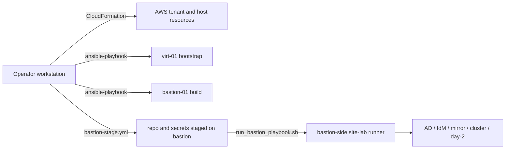
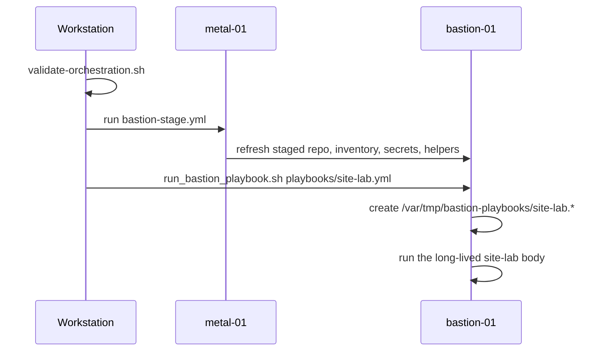
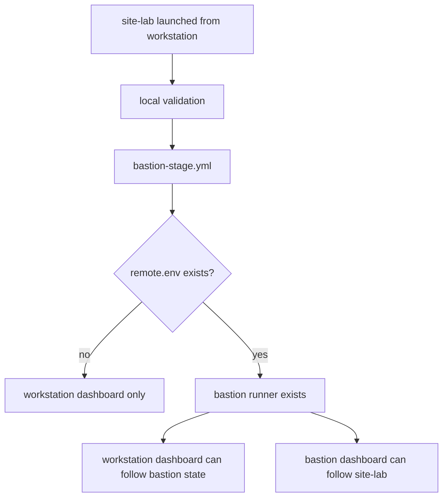

# Orchestration Plumbing

Nearby docs:

<a href="./automation-flow.md"><kbd>&nbsp;&nbsp;AUTOMATION FLOW&nbsp;&nbsp;</kbd></a>
<a href="./orchestration-guide.md"><kbd>&nbsp;&nbsp;ORCHESTRATION GUIDE&nbsp;&nbsp;</kbd></a>
<a href="./manual-process.md"><kbd>&nbsp;&nbsp;MANUAL PROCESS&nbsp;&nbsp;</kbd></a>
<a href="./README.md"><kbd>&nbsp;&nbsp;DOCS MAP&nbsp;&nbsp;</kbd></a>

This page is for the execution model itself:

- what runs on the operator workstation
- what runs on `virt-01`
- what runs on `bastion-01`
- when the tracked runner files move from local state to bastion state
- why the dashboard can show different data before and after handoff

Use <a href="./automation-flow.md"><kbd>AUTOMATION FLOW</kbd></a> for the build
order. Use this page when the question is "who is actually running this step
right now?"

## The Short Version

The automation is not one uninterrupted process.

It is a staged execution chain:

1. outer AWS prep
1. workstation-side bootstrap and bastion staging
1. bastion-side lab orchestration

The key transition is:

- `site-bootstrap.yml` is a workstation-driven phase
- `site-lab.yml` starts on the workstation, but only for validation and bastion
  staging
- the real long-running `site-lab` body then moves to bastion

## Execution Contexts

## Phase Split

### Prep

This is the outer substrate:

- `cloudformation/deploy-stack.sh tenant`
- `cloudformation/deploy-stack.sh host`

That gets you:

- VPC/subnet/security-group shape
- `virt-01`
- attached guest EBS volumes
- public ingress to the hypervisor

### `site-bootstrap.yml`

This is still workstation-led.

It imports:

- [`playbooks/bootstrap/site.yml`](../playbooks/bootstrap/site.yml)
- [`playbooks/bootstrap/bastion.yml`](../playbooks/bootstrap/bastion.yml)
- [`playbooks/bootstrap/bastion-stage.yml`](../playbooks/bootstrap/bastion-stage.yml)

What that means in practice:

- the operator workstation talks to `metal-01`
- `virt-01` is bootstrapped
- `bastion-01` is created and configured
- the repo and execution inputs are staged onto bastion

It does not automatically continue into `site-lab.yml`.

### `site-lab.yml`

This starts on the workstation but does not stay there.

The real sequence is:

So when someone asks "why doesn't bastion see `site-lab` yet?", the usual
answer is:

- because the run is still in workstation-side validation or bastion staging
- the bastion-side tracked runner does not exist until after handoff

## Runner Files And Telemetry

### Workstation-tracked state

Workstation-side wrappers write state under:

- `~/.local/state/calabi-playbooks/`

Typical files:

- `<stem>.pid`
- `<stem>.log`
- `<stem>.rc`
- `<stem>.remote.env`

Examples:

- `site-bootstrap.pid`
- `site-bootstrap.log`
- `site-lab.log`
- `site-lab.remote.env`

`site-lab.remote.env` is the handoff marker. When it exists, the workstation
knows where the bastion-side runner lives.

### Bastion-tracked state

The long-running bastion-side runner writes state under:

- `/var/tmp/bastion-playbooks/`

Typical files:

- `site-lab.pid`
- `site-lab.log`
- `site-lab.rc`

Those files do not exist during:

- workstation validation
- `bastion-stage.yml`

They appear only after the SSH handoff into:

- `scripts/run_bastion_playbook.sh`

## Wrapper Responsibilities

### `scripts/run_local_playbook.sh`

Use this for workstation-side tracked execution.

It is appropriate for:

- `site-bootstrap.yml`
- other workstation-resident playbook runs

It is responsible for:

- creating local `pid/log/rc` files
- making workstation dashboards usable before bastion exists

### `scripts/run_remote_bastion_playbook.sh`

Use this when the intended steady-state runner is bastion.

It is responsible for:

1. running the validation lane locally
1. refreshing bastion staging locally
1. SSH handoff to bastion
1. recording the remote runner paths in `<stem>.remote.env`

This is why `site-lab.yml` has two visible telemetry phases:

- local `site-lab.log` during validation/staging
- bastion `/var/tmp/bastion-playbooks/site-lab.log` after handoff

### `scripts/run_bastion_playbook.sh`

This is the bastion-native runner.

It is responsible for:

- the actual long-running `site-lab.yml` body
- tracked state under `/var/tmp/bastion-playbooks/`

## Dashboard Behavior

The dashboard follows the same split.

### Before bastion handoff

`lab-dashboard.sh site-lab` on the workstation can only see:

- local validation output
- local `bastion-stage.yml` output

So during that window:

- workstation dashboard is authoritative
- bastion dashboard will show nothing for `site-lab`

### After bastion handoff

Once `site-lab.remote.env` exists and bastion creates:

- `/var/tmp/bastion-playbooks/site-lab.pid`
- `/var/tmp/bastion-playbooks/site-lab.log`

the dashboard can follow bastion-native telemetry.

## Why The Split Exists

The split is intentional, not accidental.

Reasons:

- the workstation owns the outer SSH path to `virt-01`
- the bastion owns the inner lab network and support-service reachability
- the project wants the real long-running lab build to happen from the same
  host that later admin workflows use

That means the handoff is part of the design, not just a helper-script detail.

## Common Misreads

### "Bastion dashboard is broken because it does not show `site-lab`"

Usually false.

Often true instead:

- `site-lab` has not handed off yet
- bastion runner files do not exist yet

### "The run stopped after `site-bootstrap.yml`"

That is normal unless the next command was started.

Current design is still a two-step operator flow:

1. `site-bootstrap.yml`
1. `site-lab.yml`

### "The local `site-lab` log is the real lab run"

Only partly.

Before handoff:

- yes

After handoff:

- the local log is mostly wrapper and handoff context
- the bastion log is the real long-running orchestration log

## Operator View

If you are just running the build, the practical mental model is:

1. prepare AWS
1. run `site-bootstrap.yml`
1. run `site-lab.yml`
1. watch the workstation dashboard first
1. expect bastion tracking only after the handoff is complete

If you are debugging orchestration plumbing, this is the order to check:

1. local `pid/log/rc`
1. local validation lane
1. `bastion-stage.yml`
1. local `remote.env`
1. bastion `/var/tmp/bastion-playbooks/*`
