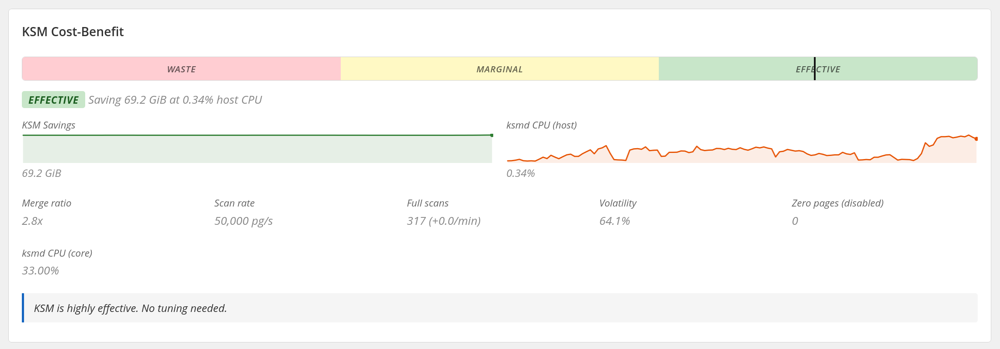
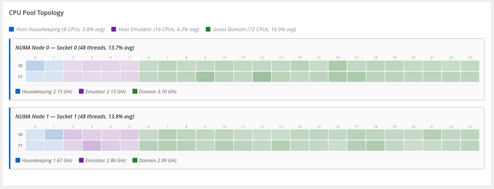
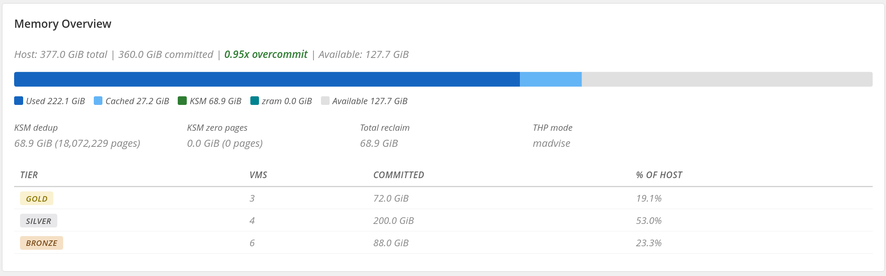
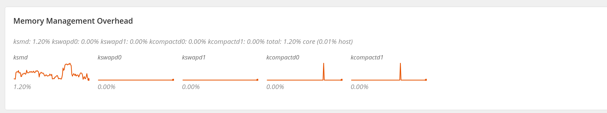

# Calabi Observer

Cockpit plugin that provides real-time observability for the host resource
management system on `virt-01`.

<a href="../../aws-metal-openshift-demo/docs/host-resource-management.md"><kbd>&nbsp;&nbsp;RESOURCE MANAGEMENT&nbsp;&nbsp;</kbd></a>
<a href="../../aws-metal-openshift-demo/docs/host-memory-oversubscription.md"><kbd>&nbsp;&nbsp;HOST MEMORY&nbsp;&nbsp;</kbd></a>
<a href="../../aws-metal-openshift-demo/docs/README.md"><kbd>&nbsp;&nbsp;DOCS MAP&nbsp;&nbsp;</kbd></a>

## Contents

- [What It Does](#what-it-does)
- [Panels](#panels)
- [Panel Screenshots](#panel-screenshots)
- [Architecture](#architecture)
- [Files](#files)
- [Data Sources](#data-sources)
- [Installation](#installation)
- [Requirements](#requirements)
- [Usage](#usage)
- [Security Posture](#security-posture)
- [Tier Colors](#tier-colors)
- [CPU Pool Colors](#cpu-pool-colors)

## What It Does

The observer answers one question: **is the tiered resource management system
working?** It collects kernel, cgroup, and libvirt metrics every 5 seconds and
renders them as six live panels in the Cockpit web console.

Without this plugin, answering that question requires reading a dozen sysfs
files, parsing `virsh` XML, diffing `/proc/stat` samples by hand, and mentally
correlating the results. The observer automates that correlation and adds
cost-benefit verdicts so you can tell at a glance whether KSM, zram, and the
CPU tier model are earning their keep.

## Panels

| Panel | Purpose |
| --- | --- |
| **KSM Cost-Benefit** | Memory savings vs CPU cost, efficiency verdict, tuning recommendations |
| **CPU Performance Domains** | Per-tier and per-VM CPU utilization, throttling, oversubscription ratio |
| **CPU Pool Topology** | Per-CPU heatmap across NUMA nodes, color-coded by pool assignment |
| **Memory Overview** | Host memory waterfall, overcommit ratio, per-tier committed memory |
| **zram Cost-Benefit** | Compression ratio, swap I/O rates, capacity utilization, kswapd cost |
| **Memory Management Overhead** | Per-thread CPU cost for ksmd, kswapd, kcompactd |

## Panel Screenshots

### KSM Cost-Benefit



### CPU Performance Domains


### CPU Pool Topology



### Memory Overview



### zram Cost-Benefit


### Memory Management Overhead



## Architecture

```
┌───────────────────────────────────────────────────────┐
│  Browser (Cockpit web console)                        │
│  ┌─────────────────────────────────────────────────┐  │
│  │  calabi-observer.js                             │  │
│  │  - polls collector.py via cockpit.spawn()       │  │
│  │  - computes deltas between samples              │  │
│  │  - renders DOM + canvas sparklines              │  │
│  └──────────────────────┬──────────────────────────┘  │
└─────────────────────────┼─────────────────────────────┘
                          │ cockpit-ws / cockpit-bridge
┌─────────────────────────┼─────────────────────────────┐
│  virt-01 (as root)      │                             │
│  ┌──────────────────────▼──────────────────────────┐  │
│  │  collector.py                                   │  │
│  │  - reads /proc/meminfo, /proc/stat, /proc/vmstat│  │
│  │  - reads /sys/kernel/mm/ksm/*, /sys/block/zram* │  │
│  │  - reads cgroup v2 cpu.stat per tier and domain  │  │
│  │  - reads /proc/<pid>/stat for kernel threads     │  │
│  │  - (full mode) runs virsh list + virsh dumpxml   │  │
│  │  - emits single JSON blob to stdout              │  │
│  └─────────────────────────────────────────────────┘  │
└───────────────────────────────────────────────────────┘
```

The frontend uses a **two-speed polling model**:

- **Fast poll** (default 5s): reads only sysfs, procfs, and cgroups. Completes
  in ~50ms. Provides CPU, memory, KSM, and zram metrics without touching
  libvirt.
- **Slow poll** (60s): full collection including `virsh list` + `virsh dumpxml`
  for each running domain. Takes 1-2s. Refreshes the domain list, tier
  assignments, vCPU counts, and memory commitments.

Delta computation happens in the browser. The collector emits cumulative
counters (CPU ticks, cgroup `usage_usec`, KSM `full_scans`); the frontend diffs
consecutive samples and divides by elapsed time to produce rates.

## Files

| File | Purpose |
| --- | --- |
| `manifest.json` | Cockpit sidebar registration and CSP policy |
| `index.html` | HTML shell with panel structure |
| `collector.py` | Backend metrics collector, runs as root via cockpit.spawn() |
| `calabi-observer.js` | Frontend: polling, delta computation, DOM rendering |
| `sparkline.js` | Canvas sparkline and stacked bar renderer (~170 lines) |
| `calabi-observer.css` | Styling: cards, gauges, bars, tables, heatmap cells |
| `cockpit-calabi-observer.spec` | RPM spec file |
| `build-rpm.sh` | RPM build script |

No build step. No React. No bundler. Vanilla JS + PatternFly CSS classes from
Cockpit's `base1`.

## Data Sources

| Source | What | Poll mode |
| --- | --- | --- |
| `/proc/meminfo` | MemTotal, MemAvailable, Cached, AnonPages, Slab, etc. | fast + full |
| `/proc/stat` | host-wide and per-CPU jiffies (user, system, idle, iowait, steal) | fast + full |
| `/proc/vmstat` | pswpin, pswpout, pgsteal, pgscan counters | fast + full |
| `/proc/cpuinfo` | per-CPU clock frequency in MHz | fast + full |
| `/sys/kernel/mm/ksm/*` | pages_shared, pages_sharing, pages_volatile, full_scans, ksm_zero_pages | fast + full |
| `/sys/kernel/mm/transparent_hugepage/*` | enabled mode, defrag mode | fast + full |
| `/sys/block/zram0/mm_stat` | orig_data, compr_data, mem_used, same_pages, pages_compacted | fast + full |
| `/sys/block/zram0/io_stat` | failed_reads, failed_writes, invalid_io | fast + full |
| `/sys/block/zram0/stat` | block device I/O counters (reads, writes, in-progress) | fast + full |
| `zramctl --bytes` | disksize, data, compressed, mem_used, algorithm, streams | fast + full |
| `swapon --bytes` | per-device size, used, priority | fast + full |
| `/proc/<pid>/stat` for ksmd, kswapd0/1, kcompactd0/1 | cumulative utime+stime ticks | fast + full |
| `/sys/fs/cgroup/machine.slice/machine-{gold,silver,bronze}.slice/cpu.stat` | usage_usec, nr_throttled, throttled_usec | fast + full |
| Per-domain cgroup `cpu.stat` | per-VM usage_usec (discovered by scanning cgroup tree) | fast + full |
| `virsh list` + `virsh dumpxml` | per-domain memory, vcpus, partition, tier classification | full only |

## Installation

### From RPM

```bash
scp rpmbuild/RPMS/noarch/cockpit-calabi-observer-1.1.0-1.fc43.noarch.rpm virt-01:
ssh virt-01 'sudo dnf install -y ./cockpit-calabi-observer-1.1.0-1.fc43.noarch.rpm'
```

### From source (rsync)

```bash
rsync -av /path/to/cockpit/calabi-observer/ virt-01:/opt/cockpit-calabi-observer/
ssh virt-01 'ln -snf /opt/cockpit-calabi-observer /usr/share/cockpit/calabi-observer'
```

Cockpit picks up new plugins on page load. No service restart needed.

### Building the RPM

```bash
./build-rpm.sh
# Output: rpmbuild/RPMS/noarch/cockpit-calabi-observer-*.noarch.rpm
#         rpmbuild/SRPMS/cockpit-calabi-observer-*.src.rpm
```

## Requirements

- `cockpit-system` and `cockpit-bridge` (Cockpit 219+)
- `python3`
- `libvirt-client` (provides `virsh`)
- Root access (collector reads sysfs, procfs, and cgroups; virsh requires
  system connection)

## Usage

Navigate to **Calabi Observer** in the Cockpit sidebar. The plugin starts
polling immediately.

Controls:

- **Interval selector**: adjust fast poll frequency (2s / 5s / 10s / 30s)
- **Pause/Resume**: stop and resume all polling
- **Status dot**: green = healthy, amber = paused, red = collection error

Append `?debug=1` to the URL to enable console logging of each poll result.

## Tier Colors

Consistent across all panels:

| Tier | Color | Hex |
| --- | --- | --- |
| Gold | yellow | `#c9b037` |
| Silver | grey | `#a8a9ad` |
| Bronze | copper | `#cd7f32` |

## CPU Pool Colors

Used in the CPU Pool Topology heatmap:

| Pool | Color | Hex |
| --- | --- | --- |
| Host Housekeeping | blue | `#1565c0` |
| Host Emulator | purple | `#7b1fa2` |
| Guest Domain | green | `#2e7d32` |

## Security Posture

The plugin runs inside Cockpit's existing authentication and authorization
boundary. It does not introduce its own auth, listen on any port, or accept
external input beyond Cockpit's channel protocol.

**Rating: B+**

Strengths:

| Area | Detail |
| --- | --- |
| No command injection | `collector.py` uses `subprocess.run()` with list arguments exclusively. No shell expansion, no string interpolation into commands. |
| XSS resistant | All DOM content is set via `textContent` and `setAttribute`. The frontend never assigns `innerHTML` from collected data. |
| No external dependencies | Zero third-party Python or JS libraries. The collector uses only the Python standard library; the frontend uses only Cockpit's `base1` and native browser APIs. |
| Read-only collector | The collector reads sysfs, procfs, cgroups, and virsh XML. It never writes to the host. |
| Input validation | The collector uses `argparse` for CLI argument parsing. The only accepted flag is `--fast`. |
| Auth delegation | Authentication and session management are handled entirely by Cockpit. The plugin declares `superuser: "require"` in `manifest.json`, so Cockpit enforces privilege escalation through its own sudo bridge. |

Residual notes:

- The `manifest.json` CSP includes `script-src 'self' 'unsafe-inline'` because
  Cockpit's own framework requires inline script evaluation. This is a Cockpit
  platform constraint, not a plugin design choice. Tightening this would require
  upstream Cockpit changes.
- The collector runs as root (via Cockpit's superuser channel) because the data
  sources it reads — `/sys/kernel/mm/ksm/*`, cgroup `cpu.stat` files, `virsh`
  system connection — require root privileges. The collector does not drop
  privileges after startup because every read path requires them.
- Error messages from the collector are written to stderr as JSON
  (`{"error": "..."}`) and are not rendered into the DOM.
